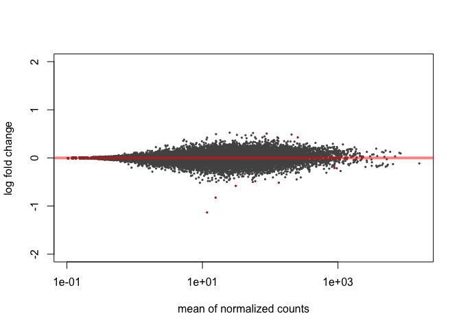
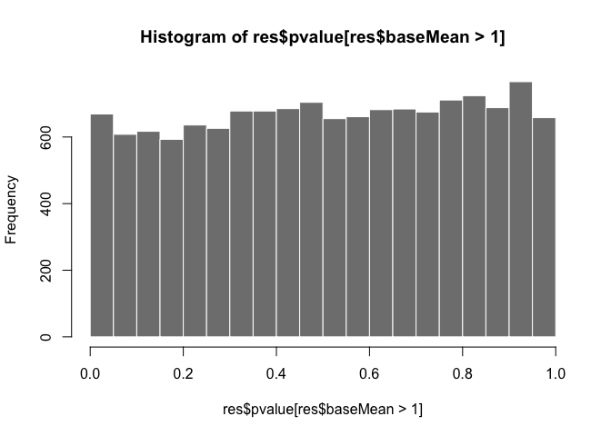
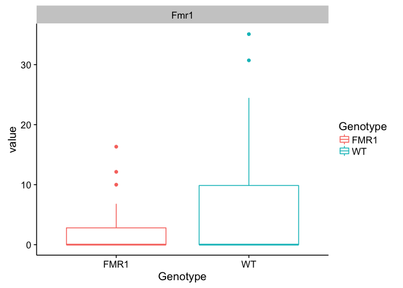
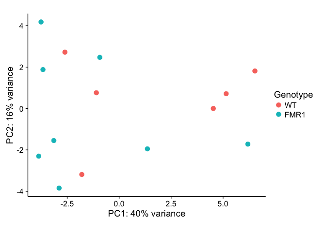

# FMR1-KO Summary

Differential gene expression analysis comparing the **CA1** region of **yoked** individuals from **WT and FMR1-KO** mice. 

## Fold change
I think its worth nothing that there aren't any genes that have huge fold change differences. 

## P values
There isn't a significant enrichment of p values at any cutoff

There are 9 differentially expressed genes by this p-value < 0.1 cutoff
    ## out of 15946 with nonzero total read count
    ## adjusted p-value < 0.1
    ## LFC > 0 (up)     : 3, 0.019% 
    ## LFC < 0 (down)   : 6, 0.038% 

Six of them are: Ccnd2 Fmr1 Serpina3n Cry2 Faim2 Nbas

    ##            baseMean log2FoldChange      lfcSE      stat       pvalue
    ##           <numeric>      <numeric>  <numeric> <numeric>    <numeric>
    ## Ccnd2      11.70261     -1.1331652 0.14396778 -7.870964 3.519179e-15
    ## Fmr1       15.63877     -0.8246208 0.14496042 -5.688593 1.280906e-08
    ## Serpina3n 133.91021     -0.5146472 0.10985625 -4.684733 2.803248e-06
    ## Cry2      255.05935      0.4265061 0.09267342  4.602248 4.179552e-06
    ## Faim2     885.97410     -0.2096753 0.05105200 -4.107093 4.006703e-05
    ## Nbas       88.81008      0.5056638 0.12203019  4.143760 3.416575e-05
     

I looked into the Fmr1 gene a little more closely. There are 6 transcripts. This show the average transcripts per million for all fmr1 transcripts for all mice in that group. You can see that its lower in FMR1-KO mice, but its not 0. I learned that only exon 5 is knocked out, so I'm looking to confirm that there are no exon 5 reads. 
    

## PCA
There is no clear pattern of clustering by genotype. 

