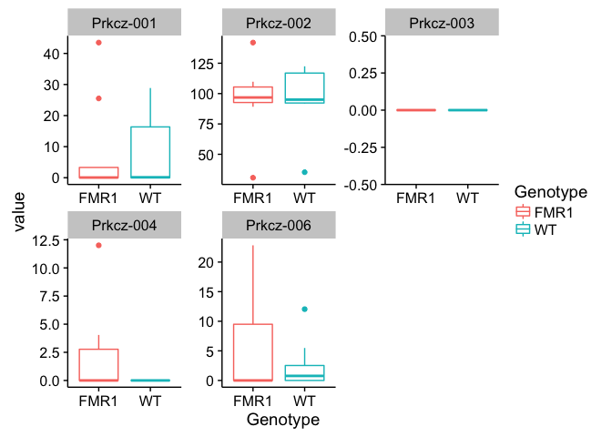
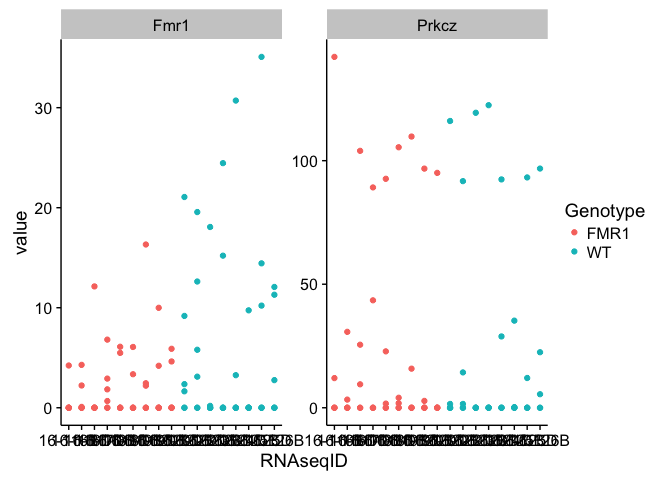
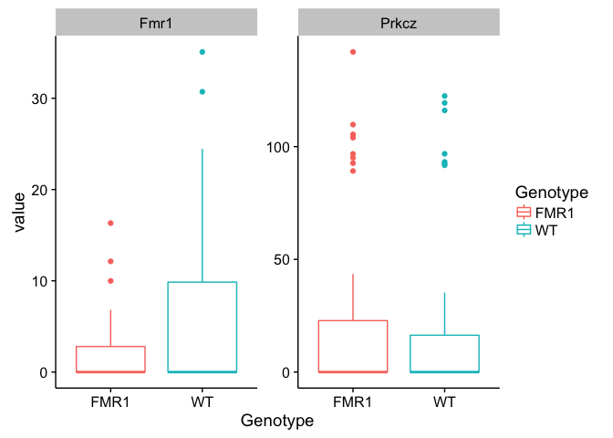

# FMR1-KO Summary

Differential gene expression analysis comparing the **CA1** region of **yoked** individuals from **WT and FMR1-KO** mice. 

There are 9 differentially expressed genes by this p-value < 0.1 cutoff
    ## out of 15946 with nonzero total read count
    ## adjusted p-value < 0.1
    ## LFC > 0 (up)     : 3, 0.019% 
    ## LFC < 0 (down)   : 6, 0.038% 

Six of them are: Ccnd2 Fmr1 Cry2 Faim2 Nbas

    ##            baseMean log2FoldChange      lfcSE      stat       pvalue
    ##           <numeric>      <numeric>  <numeric> <numeric>    <numeric>
    ## Ccnd2      11.70261     -1.1331652 0.14396778 -7.870964 3.519179e-15
    ## Fmr1       15.63877     -0.8246208 0.14496042 -5.688593 1.280906e-08
    ## Serpina3n 133.91021     -0.5146472 0.10985625 -4.684733 2.803248e-06
    ## Cry2      255.05935      0.4265061 0.09267342  4.602248 4.179552e-06
    ## Faim2     885.97410     -0.2096753 0.05105200 -4.107093 4.006703e-05
    ## Nbas       88.81008      0.5056638 0.12203019  4.143760 3.416575e-05

    
    

