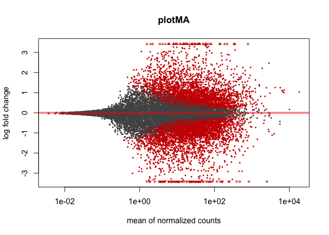
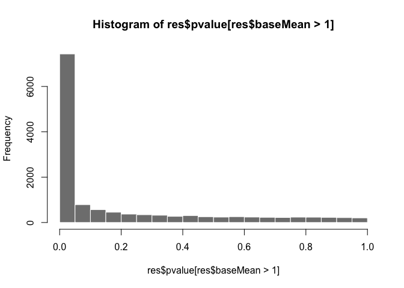
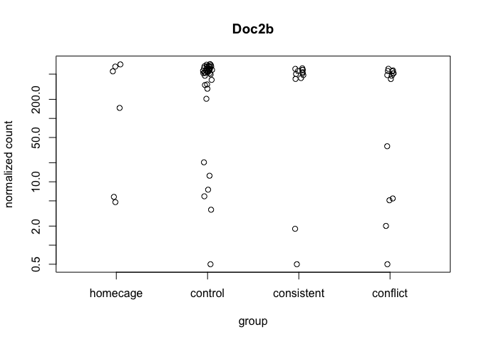
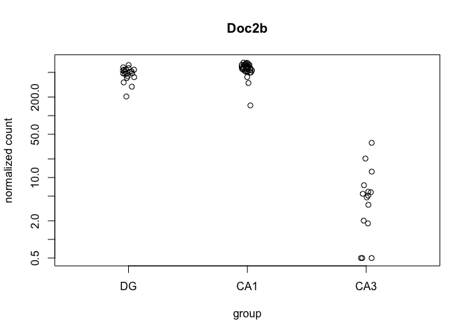
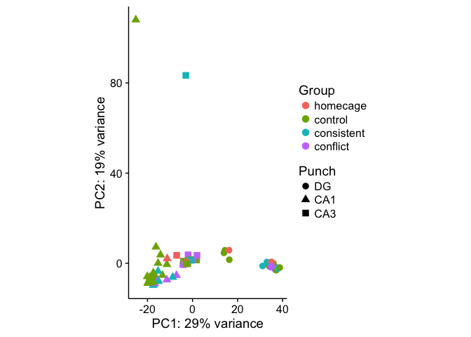
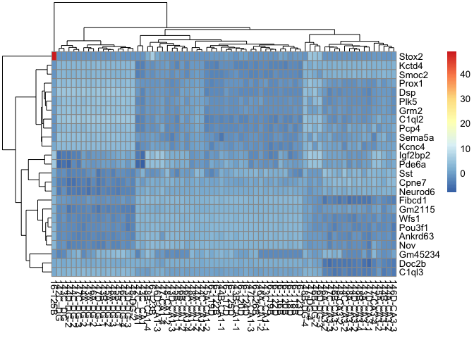
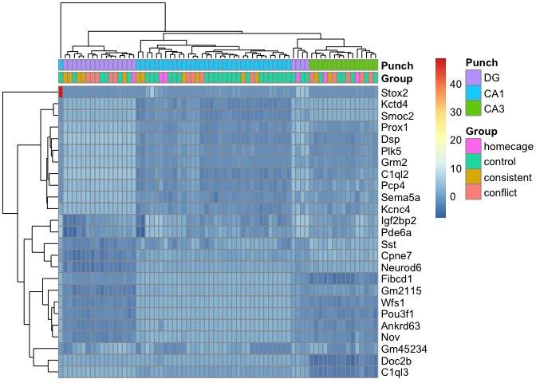

The Overall Research Question
-----------------------------

The research project was designed to understand how experience shapes
the brain. In particular, we are looking at learned avoidance behavhior.
How do animals change their behavior to avoidance an unpleasant
experience?

RNAseq samples
--------------

In the summers of 2015 and 2016, I processed a bunch of hippocampal
tissue samples from 59 mice. Most mice were trained in an active place
avoidance task or used as yoked controls; however, a few animals were
taken straight from the home cage. This data has been cleaned using a
different script `02a_punches.R`.

THis output provides a summary of the samples and the various factors
that descibe them.

    ##       RNAseqID      Mouse      year    Genotype    jobnumber  Punch   
    ##  100-CA1-1: 1   15-100 :14   2015:71   FMR1: 9   JA16268: 4   CA1:43  
    ##  100-CA1-2: 1   15-143C: 3   2016:17   WT  :79   JA16444:67   CA3:21  
    ##  100-CA1-3: 1   15-144A: 3                       JA17009:17   DG :24  
    ##  100-CA3-1: 1   15-144C: 3                                            
    ##  100-CA3-4: 1   15-145A: 3                                            
    ##  100-DG-2 : 1   15-145B: 3                                            
    ##  (Other)  :82   (Other):59                                            
    ##         Group          Conflict       APA             method  
    ##  conflict  :14   Conflict  :36   Trained:28   dissociated: 7  
    ##  consistent:14   NoConflict:32   Yoked  :40   homogenized:81  
    ##  control   :40   NA's      :20   NA's   :20                   
    ##  homecage  :20                                                
    ##                                                               
    ##                                                               
    ##                                                               
    ##      dodgy          daytime   Slice       Date   
    ##  allgood:77   afternoon : 3   1:22   9/28/15:14  
    ##  ephys  : 2   beforenoon:15   2:31   7/18/15: 9  
    ##  slice  : 9   earlyAM   : 6   3:22   7/23/15: 6  
    ##               evening   : 5   4:13   7/24/15: 6  
    ##               nighttime : 3          7/29/15: 6  
    ##               norecord  :56          7/30/15: 6  
    ##                                      (Other):41

Kallisto Gather
---------------

The kallisto output gives you read counts for sample in an abundance
file for every single sample. This portion of the code goes through and
finds each samples' abundance.tsv file, extracts the data, and combines
it all into a dataframe. The "counts" file is unnormalized, but the
"tpm" is the data after being normalized by transcripts per million. I
also use some string splitting to take the very long transcript
identifying and create a "geneids" file that has all the database
identifiers for each transcript.

(P.S. Unfortunately, I have no idea how to do this next part without
changing directories.)

Merge transcipts counts to gene counts
--------------------------------------

Kallisto is cool because it does give you transcript level stuff, but
right now I think I have more power if I just look at gene level stuff.
I'll go back and look at transcripts if I want to.

    ## Joining, by = "id"
    ## Joining, by = "id"

    ##     142C_CA1           142C_DG          143A-CA3-1         143A-DG-1      
    ##  Min.   :    0.00   Min.   :   0.00   Min.   :    0.00   Min.   :    0.0  
    ##  1st Qu.:    0.00   1st Qu.:   0.00   1st Qu.:    0.00   1st Qu.:    0.0  
    ##  Median :    2.00   Median :   2.00   Median :    2.00   Median :    2.0  
    ##  Mean   :   24.02   Mean   :  21.98   Mean   :   23.66   Mean   :   25.9  
    ##  3rd Qu.:   14.00   3rd Qu.:  15.00   3rd Qu.:   12.00   3rd Qu.:   12.0  
    ##  Max.   :19994.00   Max.   :9036.00   Max.   :13308.00   Max.   :25544.0  
    ##    143B-CA1-1        143B-DG-1           143C_CA1          143C_DG        
    ##  Min.   :    0.0   Min.   :    0.00   Min.   :    0.0   Min.   :    0.00  
    ##  1st Qu.:    0.0   1st Qu.:    0.00   1st Qu.:    0.0   1st Qu.:    0.00  
    ##  Median :    2.0   Median :    2.00   Median :    2.0   Median :    2.00  
    ##  Mean   :   26.4   Mean   :   24.46   Mean   :   23.4   Mean   :   23.57  
    ##  3rd Qu.:   11.0   3rd Qu.:   13.00   3rd Qu.:   14.0   3rd Qu.:   15.00  
    ##  Max.   :27782.0   Max.   :18912.00   Max.   :13133.0   Max.   :18685.00  
    ##    143C-CA1-1         143D-CA1-3         143D-DG-3       
    ##  Min.   :    0.00   Min.   :    0.00   Min.   :    0.00  
    ##  1st Qu.:    0.00   1st Qu.:    0.00   1st Qu.:    0.00  
    ##  Median :    2.00   Median :    1.00   Median :    2.00  
    ##  Mean   :   24.73   Mean   :   24.64   Mean   :   23.75  
    ##  3rd Qu.:   12.00   3rd Qu.:   12.00   3rd Qu.:   14.00  
    ##  Max.   :18125.00   Max.   :19703.00   Max.   :16880.00  
    ##    144A-CA1-2         144A-CA3-2         144A-DG-2       
    ##  Min.   :    0.00   Min.   :    0.00   Min.   :    0.00  
    ##  1st Qu.:    0.00   1st Qu.:    0.00   1st Qu.:    0.00  
    ##  Median :    2.00   Median :    1.00   Median :    2.00  
    ##  Mean   :   26.07   Mean   :   28.67   Mean   :   24.35  
    ##  3rd Qu.:   11.00   3rd Qu.:    8.00   3rd Qu.:   14.00  
    ##  Max.   :24613.00   Max.   :38260.00   Max.   :19211.00  
    ##    144B-CA1-1         144B-CA3-1         144C-CA1-2      
    ##  Min.   :    0.00   Min.   :    0.00   Min.   :    0.00  
    ##  1st Qu.:    0.00   1st Qu.:    0.00   1st Qu.:    0.00  
    ##  Median :    2.00   Median :    1.00   Median :    2.00  
    ##  Mean   :   25.35   Mean   :   24.93   Mean   :   24.81  
    ##  3rd Qu.:   12.00   3rd Qu.:   11.00   3rd Qu.:   12.00  
    ##  Max.   :23010.00   Max.   :20084.00   Max.   :19363.00  
    ##    144C-CA3-2         144C-DG-2          144D-CA3-2      
    ##  Min.   :    0.00   Min.   :    0.00   Min.   :    0.00  
    ##  1st Qu.:    0.00   1st Qu.:    0.00   1st Qu.:    0.00  
    ##  Median :    1.00   Median :    2.00   Median :    2.00  
    ##  Mean   :   27.33   Mean   :   23.82   Mean   :   27.66  
    ##  3rd Qu.:    9.00   3rd Qu.:   14.00   3rd Qu.:    9.00  
    ##  Max.   :30938.00   Max.   :13913.00   Max.   :35044.00  
    ##    144D-DG-2          145A-CA1-2         145A-CA3-2     
    ##  Min.   :    0.00   Min.   :    0.00   Min.   :    0.0  
    ##  1st Qu.:    0.00   1st Qu.:    0.00   1st Qu.:    0.0  
    ##  Median :    2.00   Median :    2.00   Median :    0.0  
    ##  Mean   :   23.88   Mean   :   26.57   Mean   :   26.3  
    ##  3rd Qu.:   13.00   3rd Qu.:   11.00   3rd Qu.:    9.0  
    ##  Max.   :15967.00   Max.   :27499.00   Max.   :27390.0  
    ##    145A-DG-2          145B-CA1-1         145B-DG-1       
    ##  Min.   :    0.00   Min.   :    0.00   Min.   :    0.00  
    ##  1st Qu.:    0.00   1st Qu.:    0.00   1st Qu.:    0.00  
    ##  Median :    2.00   Median :    1.00   Median :    2.00  
    ##  Mean   :   23.62   Mean   :   26.78   Mean   :   23.51  
    ##  3rd Qu.:   14.00   3rd Qu.:   11.00   3rd Qu.:   14.00  
    ##  Max.   :14783.00   Max.   :31778.00   Max.   :18049.00  
    ##    146A-CA1-2         146A-CA3-2         146A-DG-2       
    ##  Min.   :    0.00   Min.   :    0.00   Min.   :    0.00  
    ##  1st Qu.:    0.00   1st Qu.:    0.00   1st Qu.:    0.00  
    ##  Median :    1.00   Median :    1.00   Median :    2.00  
    ##  Mean   :   26.42   Mean   :   29.41   Mean   :   24.69  
    ##  3rd Qu.:   10.00   3rd Qu.:    8.00   3rd Qu.:   13.00  
    ##  Max.   :25334.00   Max.   :43024.00   Max.   :19323.00  
    ##    146B-CA1-2         146B-CA3-2         146B-DG-2       
    ##  Min.   :    0.00   Min.   :    0.00   Min.   :    0.00  
    ##  1st Qu.:    0.00   1st Qu.:    0.00   1st Qu.:    0.00  
    ##  Median :    2.00   Median :    2.00   Median :    0.00  
    ##  Mean   :   23.34   Mean   :   24.81   Mean   :   20.54  
    ##  3rd Qu.:   14.00   3rd Qu.:   11.00   3rd Qu.:    8.00  
    ##  Max.   :12770.00   Max.   :17434.00   Max.   :30815.00  
    ##    146C-CA1-4         146C-CA3-4         146C-DG-4       
    ##  Min.   :    0.00   Min.   :    0.00   Min.   :    0.00  
    ##  1st Qu.:    0.00   1st Qu.:    0.00   1st Qu.:    0.00  
    ##  Median :    2.00   Median :    0.00   Median :    1.00  
    ##  Mean   :   24.66   Mean   :   27.42   Mean   :   22.69  
    ##  3rd Qu.:   13.00   3rd Qu.:    9.00   3rd Qu.:   14.00  
    ##  Max.   :20521.00   Max.   :26486.00   Max.   :10508.00  
    ##    146D-CA1-3         146D-CA3-3         146D-DG-3      
    ##  Min.   :    0.00   Min.   :    0.00   Min.   :    0.0  
    ##  1st Qu.:    0.00   1st Qu.:    0.00   1st Qu.:    0.0  
    ##  Median :    0.00   Median :    2.00   Median :    0.0  
    ##  Mean   :   23.19   Mean   :   24.67   Mean   :   20.1  
    ##  3rd Qu.:    8.00   3rd Qu.:   12.00   3rd Qu.:    4.0  
    ##  Max.   :22343.00   Max.   :21103.00   Max.   :29508.0  
    ##    147-CA1-4          147-CA3-4           147-DG-4       
    ##  Min.   :    0.00   Min.   :    0.00   Min.   :    0.00  
    ##  1st Qu.:    0.00   1st Qu.:    0.00   1st Qu.:    0.00  
    ##  Median :    0.00   Median :    0.00   Median :    0.00  
    ##  Mean   :   22.36   Mean   :   23.63   Mean   :   20.58  
    ##  3rd Qu.:    4.00   3rd Qu.:    8.00   3rd Qu.:    2.00  
    ##  Max.   :25916.00   Max.   :18064.00   Max.   :21507.00  
    ##    147C-CA1-3         147C-CA3-3         147C-DG-3       
    ##  Min.   :    0.00   Min.   :    0.00   Min.   :    0.00  
    ##  1st Qu.:    0.00   1st Qu.:    0.00   1st Qu.:    0.00  
    ##  Median :    2.00   Median :    2.00   Median :    3.00  
    ##  Mean   :   25.15   Mean   :   28.39   Mean   :   24.47  
    ##  3rd Qu.:   13.00   3rd Qu.:   10.00   3rd Qu.:   14.00  
    ##  Max.   :21638.00   Max.   :38426.00   Max.   :18962.00  
    ##    147D-CA3-1         147D-DG-1          148-CA1-2       
    ##  Min.   :    0.00   Min.   :    0.00   Min.   :    0.00  
    ##  1st Qu.:    0.00   1st Qu.:    0.00   1st Qu.:    0.00  
    ##  Median :    2.00   Median :    2.00   Median :    1.00  
    ##  Mean   :   27.19   Mean   :   23.61   Mean   :   24.83  
    ##  3rd Qu.:   10.00   3rd Qu.:   14.00   3rd Qu.:   12.00  
    ##  Max.   :30897.00   Max.   :15216.00   Max.   :22177.00  
    ##    148-CA3-2          148-DG-2          148A-CA1-3      
    ##  Min.   :    0.0   Min.   :    0.00   Min.   :    0.00  
    ##  1st Qu.:    0.0   1st Qu.:    0.00   1st Qu.:    0.00  
    ##  Median :    1.0   Median :    1.00   Median :    2.00  
    ##  Mean   :   24.3   Mean   :   23.05   Mean   :   24.93  
    ##  3rd Qu.:   11.0   3rd Qu.:   14.00   3rd Qu.:   12.00  
    ##  Max.   :16496.0   Max.   :12329.00   Max.   :18801.00  
    ##    148A-CA3-3         148A-DG-3          148B-CA1-4      
    ##  Min.   :    0.00   Min.   :    0.00   Min.   :    0.00  
    ##  1st Qu.:    0.00   1st Qu.:    0.00   1st Qu.:    0.00  
    ##  Median :    1.00   Median :    3.00   Median :    0.00  
    ##  Mean   :   25.43   Mean   :   23.54   Mean   :   25.25  
    ##  3rd Qu.:   10.00   3rd Qu.:   15.00   3rd Qu.:    8.00  
    ##  Max.   :19835.00   Max.   :15700.00   Max.   :54348.00  
    ##    148B-CA3-4         148B-DG-4           16-116B        
    ##  Min.   :    0.00   Min.   :    0.00   Min.   :    0.00  
    ##  1st Qu.:    0.00   1st Qu.:    0.00   1st Qu.:    0.00  
    ##  Median :    2.00   Median :    2.00   Median :    2.00  
    ##  Mean   :   25.15   Mean   :   25.11   Mean   :   22.18  
    ##  3rd Qu.:   11.00   3rd Qu.:   12.00   3rd Qu.:   13.00  
    ##  Max.   :19770.00   Max.   :21584.00   Max.   :11884.00  
    ##     16-116D            16-117D            16-118B        
    ##  Min.   :    0.00   Min.   :    0.00   Min.   :    0.00  
    ##  1st Qu.:    0.00   1st Qu.:    0.00   1st Qu.:    0.00  
    ##  Median :    0.00   Median :    2.00   Median :    2.00  
    ##  Mean   :   20.66   Mean   :   22.48   Mean   :   22.37  
    ##  3rd Qu.:    3.00   3rd Qu.:   13.00   3rd Qu.:   13.00  
    ##  Max.   :89831.00   Max.   :11514.00   Max.   :10517.00  
    ##     16-118D            16-119B            16-119D        
    ##  Min.   :    0.00   Min.   :    0.00   Min.   :    0.00  
    ##  1st Qu.:    0.00   1st Qu.:    0.00   1st Qu.:    0.00  
    ##  Median :    2.00   Median :    2.00   Median :    2.00  
    ##  Mean   :   23.38   Mean   :   24.11   Mean   :   22.43  
    ##  3rd Qu.:   13.00   3rd Qu.:   12.00   3rd Qu.:   13.00  
    ##  Max.   :12942.00   Max.   :14617.00   Max.   :10258.00  
    ##     16-120B           16-120D            16-122B        
    ##  Min.   :   0.00   Min.   :    0.00   Min.   :    0.00  
    ##  1st Qu.:   0.00   1st Qu.:    0.00   1st Qu.:    0.00  
    ##  Median :   2.00   Median :    2.00   Median :    2.00  
    ##  Mean   :  22.06   Mean   :   22.69   Mean   :   23.94  
    ##  3rd Qu.:  13.00   3rd Qu.:   13.00   3rd Qu.:   12.00  
    ##  Max.   :9640.00   Max.   :12280.00   Max.   :14795.00  
    ##     16-122D            16-123B            16-123D        
    ##  Min.   :    0.00   Min.   :    0.00   Min.   :    0.00  
    ##  1st Qu.:    0.00   1st Qu.:    0.00   1st Qu.:    0.00  
    ##  Median :    2.00   Median :    0.00   Median :    2.00  
    ##  Mean   :   23.63   Mean   :   21.45   Mean   :   22.99  
    ##  3rd Qu.:   13.00   3rd Qu.:   10.00   3rd Qu.:   13.00  
    ##  Max.   :13117.00   Max.   :24154.00   Max.   :12331.00  
    ##     16-124D            16-125B            16-125D        
    ##  Min.   :    0.00   Min.   :    0.00   Min.   :    0.00  
    ##  1st Qu.:    0.00   1st Qu.:    0.00   1st Qu.:    0.00  
    ##  Median :    2.00   Median :    1.00   Median :    2.00  
    ##  Mean   :   22.54   Mean   :   14.37   Mean   :   22.79  
    ##  3rd Qu.:   13.00   3rd Qu.:    5.00   3rd Qu.:   13.00  
    ##  Max.   :10451.00   Max.   :78181.00   Max.   :11716.00  
    ##     16-126B        
    ##  Min.   :    0.00  
    ##  1st Qu.:    0.00  
    ##  Median :    2.00  
    ##  Mean   :   24.34  
    ##  3rd Qu.:   12.00  
    ##  Max.   :16647.00

DESeq Analysis
--------------

Now, I'll look for differential gene expression between of the various
factors. This analysis was developed by reading the DESEq manual. In
many place, I try to provide the chapter where these steps are described
in more details.

    # 1.3.3 Count matrix input ----
    countData <- countbygene 
    colData <- tidysamples %>%
      arrange(RNAseqID) # needs to be in same order a countData
    head(countData)

    ##               142C_CA1 142C_DG 143A-CA3-1 143A-DG-1 143B-CA1-1 143B-DG-1
    ## 0610007P14Rik       60      44         42        56         30        24
    ## 0610009B22Rik       31      14         12        17         10         5
    ## 0610009L18Rik        0       0          4         9         10         8
    ## 0610009O20Rik      128     112         85       185         44        72
    ## 0610010F05Rik       14      16         18        19          7        15
    ## 0610010K14Rik        2       1          2         7          1         2
    ##               143C_CA1 143C_DG 143C-CA1-1 143D-CA1-3 143D-DG-3 144A-CA1-2
    ## 0610007P14Rik       41      16         19         14        22         40
    ## 0610009B22Rik       22      10         10          0         0         15
    ## 0610009L18Rik        6       0          2          0         2          9
    ## 0610009O20Rik      170     109         76         25        38         95
    ## 0610010F05Rik       43      16          7          5         8         15
    ## 0610010K14Rik        6       3          2          2         1          3
    ##               144A-CA3-2 144A-DG-2 144B-CA1-1 144B-CA3-1 144C-CA1-2
    ## 0610007P14Rik         10        40         36         17         32
    ## 0610009B22Rik          4         4          7          4          8
    ## 0610009L18Rik          5         0          1          4          2
    ## 0610009O20Rik         20        82         49         24         89
    ## 0610010F05Rik          2        17          9          3         12
    ## 0610010K14Rik          1         2          4          1          3
    ##               144C-CA3-2 144C-DG-2 144D-CA3-2 144D-DG-2 145A-CA1-2
    ## 0610007P14Rik         14        25         22        75         66
    ## 0610009B22Rik         12         8          6        12         18
    ## 0610009L18Rik          4         6          9        13         21
    ## 0610009O20Rik         48        85         46       151         96
    ## 0610010F05Rik          7        12         14        18         22
    ## 0610010K14Rik          1         2          2         6          3
    ##               145A-CA3-2 145A-DG-2 145B-CA1-1 145B-DG-1 146A-CA1-2
    ## 0610007P14Rik          2        20         26        10         14
    ## 0610009B22Rik          3         7          8         5          8
    ## 0610009L18Rik          0         1          3         0          8
    ## 0610009O20Rik         12        52        124        46         68
    ## 0610010F05Rik          1         6          4         5          9
    ## 0610010K14Rik          0         2          2         2          3
    ##               146A-CA3-2 146A-DG-2 146B-CA1-2 146B-CA3-2 146B-DG-2
    ## 0610007P14Rik         44        12          6         16         0
    ## 0610009B22Rik          4         3          3         22         0
    ## 0610009L18Rik          9         6          0          2         0
    ## 0610009O20Rik        102        44         16         46         2
    ## 0610010F05Rik         10         6          7         14         1
    ## 0610010K14Rik          1         2          1          1         1
    ##               146C-CA1-4 146C-CA3-4 146C-DG-4 146D-CA1-3 146D-CA3-3
    ## 0610007P14Rik         19          2        11          6         44
    ## 0610009B22Rik          4          4         3          2         12
    ## 0610009L18Rik          9          0         0          0          7
    ## 0610009O20Rik         31          3        10          1         83
    ## 0610010F05Rik          5          1         4          1         18
    ## 0610010K14Rik          1          0         0          1          1
    ##               146D-DG-3 147-CA1-4 147-CA3-4 147-DG-4 147C-CA1-3 147C-CA3-3
    ## 0610007P14Rik         3         1        46        0         34         82
    ## 0610009B22Rik         0         1        10        4          8         15
    ## 0610009L18Rik         0         0         0        0          2         11
    ## 0610009O20Rik         3         0        29        0         58        191
    ## 0610010F05Rik         0         2         0        2         19         41
    ## 0610010K14Rik         0         0         1        0          4          3
    ##               147C-DG-3 147D-CA3-1 147D-DG-1 148-CA1-2 148-CA3-2 148-DG-2
    ## 0610007P14Rik        41         40       152        24        29       21
    ## 0610009B22Rik        20         20        52         3        23        8
    ## 0610009L18Rik         3          9        67        13         0        0
    ## 0610009O20Rik       145         88       377        27        91      164
    ## 0610010F05Rik        23         28        56         9        19        7
    ## 0610010K14Rik         2          0        16         0         2        1
    ##               148A-CA1-3 148A-CA3-3 148A-DG-3 148B-CA1-4 148B-CA3-4
    ## 0610007P14Rik         68         28        52          2         61
    ## 0610009B22Rik         30         12         8          0         22
    ## 0610009L18Rik         16          7        11          0         11
    ## 0610009O20Rik        162         65       226          0         70
    ## 0610010F05Rik         25         19        22          0         22
    ## 0610010K14Rik          5          4         2          0          4
    ##               148B-DG-4 16-116B 16-116D 16-117D 16-118B 16-118D 16-119B
    ## 0610007P14Rik         8      19       2      19      13      21      25
    ## 0610009B22Rik         1      10       0       8       6      12      10
    ## 0610009L18Rik         1       5       0       0       2      10       2
    ## 0610009O20Rik        18      40       3      35      86      28      62
    ## 0610010F05Rik         3       8       0       9      16      10      10
    ## 0610010K14Rik         1       3       0       1       1       1       3
    ##               16-119D 16-120B 16-120D 16-122B 16-122D 16-123B 16-123D
    ## 0610007P14Rik      19      16      19      28      35       4      22
    ## 0610009B22Rik       8       8       2      25      16       0       9
    ## 0610009L18Rik       1       3       0       8       6       0       5
    ## 0610009O20Rik      60      93      94      69      89       4      62
    ## 0610010F05Rik      12      13      11      14      15       3      12
    ## 0610010K14Rik       2       2       0       2       3       0       1
    ##               16-124D 16-125B 16-125D 16-126B
    ## 0610007P14Rik      20       2      15      24
    ## 0610009B22Rik      12       0       5      11
    ## 0610009L18Rik       3       0       0      18
    ## 0610009O20Rik      40      13      61      92
    ## 0610010F05Rik      12       1       9       9
    ## 0610010K14Rik       3       0       1       4

    head(colData)

    ##    RNAseqID  Mouse year Genotype jobnumber Punch    Group Conflict  APA
    ## 1 100-CA1-1 15-100 2015       WT   JA16444   CA1 homecage     <NA> <NA>
    ## 2 100-CA1-2 15-100 2015       WT   JA16444   CA1 homecage     <NA> <NA>
    ## 3 100-CA1-3 15-100 2015       WT   JA16444   CA1 homecage     <NA> <NA>
    ## 4 100-CA3-1 15-100 2015       WT   JA16444   CA3 homecage     <NA> <NA>
    ## 5 100-CA3-4 15-100 2015       WT   JA16444   CA3 homecage     <NA> <NA>
    ## 6  100-DG-2 15-100 2015       WT   JA16444    DG homecage     <NA> <NA>
    ##        method   dodgy  daytime Slice    Date
    ## 1 homogenized allgood norecord     1 9/28/15
    ## 2 homogenized allgood norecord     2 9/28/15
    ## 3 homogenized allgood norecord     3 9/28/15
    ## 4 homogenized allgood norecord     1 9/28/15
    ## 5 homogenized allgood norecord     4 9/28/15
    ## 6 homogenized allgood norecord     2 9/28/15

    ## eh, I have a few too many samples in the countDataFrame
    savecols <- colnames(countData)
    colData <- colData %>%
      filter(RNAseqID %in% savecols) %>% droplevels()

    ## remove outliers as per 1st pca

    ## removeing outliers
    colData <- colData %>%
      filter(RNAseqID != "146C-CA3-4", RNAseqID != "16-116D") # needs to be in same order a countData
    savecols <- as.character(colData$RNAseqID) #select the sample name column that corresponds to row names
    savecols <- as.vector(savecols) # make it a vector
    countData <- countData %>% select(one_of(savecols)) # select just the columns that match the samples in colData

    ## remove genes with total counts across all samples < 2
    countData[countData < 2] <- 0

    ## differential gene expression
    dds <- DESeqDataSetFromMatrix(countData = countData,
    colData = colData,
    design = ~ Group + Punch)

    ## converting counts to integer mode

    dds

    ## class: DESeqDataSet 
    ## dim: 22485 70 
    ## metadata(1): version
    ## assays(1): counts
    ## rownames(22485): 0610007P14Rik 0610009B22Rik ... Zzef1 Zzz3
    ## rowData names(0):
    ## colnames(70): 142C_CA1 142C_DG ... 16-125D 16-126B
    ## colData names(14): RNAseqID Mouse ... Slice Date

    ## 1.3.6 Pre-filtering
    dds <- dds[ rowSums(counts(dds)) > 1, ]

    ## 1.3.7 Note on factor levels
    dds$Group <- factor(dds$Group, levels=c("homecage","control","consistent", "conflict"))
    dds$Punch <- factor(dds$Punch, levels=c("DG","CA1", "CA3"))

    ## 1.4  Differential expression analysi
    dds <- DESeq(dds)

    ## estimating size factors

    ## estimating dispersions

    ## gene-wise dispersion estimates

    ## mean-dispersion relationship

    ## final dispersion estimates

    ## fitting model and testing

    ## -- replacing outliers and refitting for 673 genes
    ## -- DESeq argument 'minReplicatesForReplace' = 7 
    ## -- original counts are preserved in counts(dds)

    ## estimating dispersions

    ## fitting model and testing

    # general deseq
    res <- results(dds, independentFiltering = F)
    resOrdered <- res[order(res$padj),]
    head(resOrdered,10)

    ## log2 fold change (MAP): Punch CA3 vs DG 
    ## Wald test p-value: Punch CA3 vs DG 
    ## DataFrame with 10 rows and 6 columns
    ##                baseMean log2FoldChange      lfcSE      stat        pvalue
    ##               <numeric>      <numeric>  <numeric> <numeric>     <numeric>
    ## Doc2b          424.5281      -6.461417 0.18384984 -35.14508 1.382026e-270
    ## Pitpnm2        142.8426      -3.246536 0.10310149 -31.48874 1.238734e-217
    ## C1ql3          269.4539      -6.939982 0.22807897 -30.42798 2.343508e-203
    ## Fam163b        515.5785      -5.521926 0.18685234 -29.55235 6.126197e-192
    ## Adcy1         2746.1178      -4.000904 0.14316989 -27.94515 7.550762e-172
    ## Gnao1          170.5782       1.420943 0.05178648  27.43849 9.531129e-166
    ## Lynx1          273.8072       2.571880 0.09814446  26.20504 2.327998e-151
    ## Syn2           339.6125       1.570916 0.06038751  26.01392 3.446537e-149
    ## 2010300C02Rik  515.5477      -2.449168 0.09702642 -25.24228 1.376722e-140
    ## Syngr1         147.5799       1.850054 0.07334744  25.22316 2.231934e-140
    ##                        padj
    ##                   <numeric>
    ## Doc2b         2.453096e-266
    ## Pitpnm2       1.099377e-213
    ## C1ql3         1.386575e-199
    ## Fam163b       2.718500e-188
    ## Adcy1         2.680521e-168
    ## Gnao1         2.819626e-162
    ## Lynx1         5.903137e-148
    ## Syn2          7.647003e-146
    ## 2010300C02Rik 2.715202e-137
    ## Syngr1        3.961683e-137

    sum(res$padj < 0.1, na.rm = TRUE) 

    ## [1] 7380

    res05 <- results(dds, alpha=0.05)
    table(res05$padj < .05)

    ## 
    ## FALSE  TRUE 
    ##  7542  6831

    sum(res05$padj < 0.05, na.rm=TRUE)

    ## [1] 6831

    ## 1.5 exploring and reporting results

    plotMA(res, main="plotMA")

    resMLE <- results(dds)
    head(resMLE, 4)

    ## log2 fold change (MAP): Punch CA3 vs DG 
    ## Wald test p-value: Punch CA3 vs DG 
    ## DataFrame with 4 rows and 6 columns
    ##                baseMean log2FoldChange     lfcSE       stat     pvalue
    ##               <numeric>      <numeric> <numeric>  <numeric>  <numeric>
    ## 0610007P14Rik 20.521964      0.3893900 0.1973029  1.9735644 0.04843130
    ## 0610009B22Rik  7.408938      0.8217232 0.2661621  3.0873039 0.00201981
    ## 0610009L18Rik  3.210245      0.5470837 0.5220123  1.0480284 0.29462551
    ## 0610009O20Rik 48.192647     -0.1726400 0.1845391 -0.9355201 0.34952035
    ##                     padj
    ##                <numeric>
    ## 0610007P14Rik 0.09240714
    ## 0610009B22Rik 0.00562611
    ## 0610009L18Rik 0.41105149
    ## 0610009O20Rik 0.46972006

    hist(res$pvalue[res$baseMean > 1], breaks=0:20/20, col="grey50", border="white")

    plotCounts(dds, gene=which.min(res$padj), intgroup="Group")

    plotCounts(dds, gene=which.min(res$padj), intgroup="Punch")

    respadj <- as.data.frame(res$padj)
    head(respadj)

    ##      res$padj
    ## 1 0.114058048
    ## 2 0.006947989
    ## 3 0.502991522
    ## 4 0.573010643
    ## 5 0.071053627
    ## 6 0.272157185

    ## 1.5 more info
    mcols(res)$description

    ## [1] "mean of normalized counts for all samples"
    ## [2] "log2 fold change (MAP): Punch CA3 vs DG"  
    ## [3] "standard error: Punch CA3 vs DG"          
    ## [4] "Wald statistic: Punch CA3 vs DG"          
    ## [5] "Wald test p-value: Punch CA3 vs DG"       
    ## [6] "BH adjusted p-values"

    ## for variance stablized gene expression and log transformed data
    rld <- rlog(dds, blind=FALSE)
    vsd <- varianceStabilizingTransformation(dds, blind=FALSE)
    vsd.fast <- vst(dds, blind=FALSE)
    head(assay(rld), 3)

    ##                142C_CA1   142C_DG 143A-CA3-1 143A-DG-1 143B-CA1-1
    ## 0610007P14Rik 4.3680546 4.2826258   4.346341  4.182953   4.691853
    ## 0610009B22Rik 3.0860879 2.6581924   2.626913  2.559275   2.974106
    ## 0610009L18Rik 0.8540732 0.8678653   1.320091  1.462775   2.138681
    ##               143B-DG-1 143C_CA1   143C_DG 143C-CA1-1 143D-CA1-3 143D-DG-3
    ## 0610007P14Rik  4.250679 3.555186 3.4016862   3.932075  4.3654771  4.882537
    ## 0610009B22Rik  2.379160 2.516878 2.4995243   2.762587  1.7416850  1.754528
    ## 0610009L18Rik  1.867181 1.196393 0.8744423   1.228406  0.9852113  1.502572
    ##               144A-CA1-2 144A-CA3-2 144A-DG-2 144B-CA1-1 144B-CA3-1
    ## 0610007P14Rik   4.410221   5.082189 4.3944978   4.472906   4.626085
    ## 0610009B22Rik   2.864806   3.361472 2.0691668   2.460478   2.684168
    ## 0610009L18Rik   1.736350   2.636336 0.8821811   0.896601   1.853542
    ##               144C-CA1-2 144C-CA3-2 144C-DG-2 144D-CA3-2 144D-DG-2
    ## 0610007P14Rik   4.052805   4.289459  4.236971   4.122592   4.56565
    ## 0610009B22Rik   2.360378   3.415270  2.632502   2.459929   2.38467
    ## 0610009L18Rik   1.121483   1.780394  1.675024   1.915691   1.67917
    ##               145A-CA1-2 145A-CA3-2 145A-DG-2 145B-CA1-1 145B-DG-1
    ## 0610007P14Rik   4.455898   3.892505 4.4372021   4.418591 3.7749650
    ## 0610009B22Rik   2.666410   3.316500 2.8283868   2.726571 2.6072460
    ## 0610009L18Rik   1.978510   1.207248 0.9511375   1.420774 0.9518726
    ##               146A-CA1-2 146A-CA3-2 146A-DG-2 146B-CA1-2 146B-CA3-2
    ## 0610007P14Rik   3.942070   4.752191  4.113503  3.6324161   3.826297
    ## 0610009B22Rik   2.822436   2.193812  2.419435  2.5023977   3.435793
    ## 0610009L18Rik   1.999683   1.865608  2.011775  0.9906043   1.246398
    ##               146B-DG-2 146C-CA1-4 146C-DG-4 146D-CA1-3 146D-CA3-3
    ## 0610007P14Rik  3.557297   4.507949  4.920990   4.587475   4.548852
    ## 0610009B22Rik  2.434866   2.542511  2.964953   2.874700   2.729415
    ## 0610009L18Rik  1.471230   2.252988  1.095343   1.145029   1.621972
    ##               146D-DG-3 147-CA1-4 147-CA3-4 147-DG-4 147C-CA1-3 147C-CA3-3
    ## 0610007P14Rik  5.150217  3.413903  6.243430 3.479221   4.205892   4.601074
    ## 0610009B22Rik  2.489284  2.324378  3.758172 4.189579   2.415709   2.489058
    ## 0610009L18Rik  1.513809  1.384779  1.056396 1.423005   1.144264   1.564706
    ##               147C-DG-3 147D-CA3-1 147D-DG-1 148-CA1-2 148-CA3-2 148-DG-2
    ## 0610007P14Rik  4.098393   4.010549  4.368071  4.354110 4.3209259 4.046583
    ## 0610009B22Rik  2.836312   2.790413  2.769768  2.178835 3.3968501 2.621506
    ## 0610009L18Rik  1.164452   1.538325  2.150671  2.257739 0.9025552 0.906939
    ##               148A-CA1-3 148A-CA3-3 148A-DG-3 148B-CA1-4 148B-CA3-4
    ## 0610007P14Rik   4.339643   4.205626  4.402845   3.937793   4.728573
    ## 0610009B22Rik   2.940382   2.815066  2.275970   2.142053   3.068767
    ## 0610009L18Rik   1.729952   1.682721  1.701599   1.222737   1.783318
    ##               148B-DG-4  16-116B   16-117D  16-118B  16-118D  16-119B
    ## 0610007P14Rik  4.116998 4.039606 4.4238274 3.367074 4.067697 4.022068
    ## 0610009B22Rik  1.826017 2.840447 2.9534251 2.295320 2.924108 2.638022
    ## 0610009L18Rik  1.024501 1.619194 0.9554746 1.163665 1.977182 1.177011
    ##                 16-119D  16-120B   16-120D  16-122B  16-122D  16-123B
    ## 0610007P14Rik 3.8189751 3.552881 3.9750119 4.108134 4.175833 3.622129
    ## 0610009B22Rik 2.5341646 2.463212 1.9556637 3.322039 2.843051 1.853382
    ## 0610009L18Rik 0.8953857 1.276296 0.9093414 1.704076 1.487043 1.037571
    ##                16-123D  16-124D  16-125B   16-125D  16-126B
    ## 0610007P14Rik 3.978058 3.875998 3.862728 3.8087405 3.969233
    ## 0610009B22Rik 2.622746 2.816832 2.114145 2.3887631 2.694578
    ## 0610009L18Rik 1.522678 1.316978 1.197082 0.9149803 2.228167

pca plot
--------

    pcaData <- plotPCA(rld, intgroup = c( "Group", "Punch"), returnData=TRUE)
    pcaData

    ##                    PC1         PC2            group      Group Punch
    ## 142C_CA1   -18.1776505 -10.1448583 consistent : CA1 consistent   CA1
    ## 142C_DG     36.7297015 -12.2805464  consistent : DG consistent    DG
    ## 143A-CA3-1  -5.2632827  28.0090716   conflict : CA3   conflict   CA3
    ## 143A-DG-1   35.8035478  -5.1016899    conflict : DG   conflict    DG
    ## 143B-CA1-1 -15.9410958  -5.6972950    control : CA1    control   CA1
    ## 143B-DG-1   33.2877891  -3.5882750     control : DG    control    DG
    ## 143C_CA1   -18.2072175  -8.9838171 consistent : CA1 consistent   CA1
    ## 143C_DG     30.7238949  -5.8661008  consistent : DG consistent    DG
    ## 143C-CA1-1 -17.7546625  -7.8454704 consistent : CA1 consistent   CA1
    ## 143D-CA1-3 -17.5104984  -6.4342764    control : CA1    control   CA1
    ## 143D-DG-3   33.3825923  -4.6844950     control : DG    control    DG
    ## 144A-CA1-2  -8.1194198  -2.4828915   conflict : CA1   conflict   CA1
    ## 144A-CA3-2  -2.3595655  22.8777089   conflict : CA3   conflict   CA3
    ## 144A-DG-2   36.5248853  -7.0960092    conflict : DG   conflict    DG
    ## 144B-CA1-1 -18.2761076  -6.3157305    control : CA1    control   CA1
    ## 144B-CA3-1   0.8986960  21.4125803    control : CA3    control   CA3
    ## 144C-CA1-2  -9.7386584  -4.9277295 consistent : CA1 consistent   CA1
    ## 144C-CA3-2  -3.0641252  24.9137086 consistent : CA3 consistent   CA3
    ## 144C-DG-2   37.7305148  -9.0374434  consistent : DG consistent    DG
    ## 144D-CA3-2  -3.2016217  27.4655339    control : CA3    control   CA3
    ## 144D-DG-2   36.5440596  -5.8864329     control : DG    control    DG
    ## 145A-CA1-2 -17.5560879  -6.5203039   conflict : CA1   conflict   CA1
    ## 145A-CA3-2   1.5523936  16.9147913   conflict : CA3   conflict   CA3
    ## 145A-DG-2   33.9892529  -6.6485719    conflict : DG   conflict    DG
    ## 145B-CA1-1 -16.6240234  -6.7044877    control : CA1    control   CA1
    ## 145B-DG-1   35.2872066  -5.5060733     control : DG    control    DG
    ## 146A-CA1-2 -15.9696209  -5.2771787   conflict : CA1   conflict   CA1
    ## 146A-CA3-2  -0.7973897  26.3273612   conflict : CA3   conflict   CA3
    ## 146A-DG-2   34.1090503  -5.3662004    conflict : DG   conflict    DG
    ## 146B-CA1-2 -13.5094192  -7.7007626    control : CA1    control   CA1
    ## 146B-CA3-2  -4.9205437  27.3306135    control : CA3    control   CA3
    ## 146B-DG-2   13.5435385   0.4424828     control : DG    control    DG
    ## 146C-CA1-4 -14.9711850 -10.5347635 consistent : CA1 consistent   CA1
    ## 146C-DG-4   32.4148903  -7.0475927  consistent : DG consistent    DG
    ## 146D-CA1-3 -10.8861375  -3.5644580    control : CA1    control   CA1
    ## 146D-CA3-3  -1.8751030  25.6276605    control : CA3    control   CA3
    ## 146D-DG-3   13.8089719   0.4562047     control : DG    control    DG
    ## 147-CA1-4  -10.4689132  -1.4523333   homecage : CA1   homecage   CA1
    ## 147-CA3-4   -6.5553322  24.9319548   homecage : CA3   homecage   CA3
    ## 147-DG-4    16.2975479  -3.9602299    homecage : DG   homecage    DG
    ## 147C-CA1-3 -15.6654370  -6.8682676 consistent : CA1 consistent   CA1
    ## 147C-CA3-3  -1.6184147  25.1003720 consistent : CA3 consistent   CA3
    ## 147C-DG-3   37.3935192  -7.8392099  consistent : DG consistent    DG
    ## 147D-CA3-1  -4.0207852  27.9384629    control : CA3    control   CA3
    ## 147D-DG-1   38.4042777  -6.3170623     control : DG    control    DG
    ## 148-CA1-2  -18.5394758  -5.6708153   homecage : CA1   homecage   CA1
    ## 148-CA3-2   -3.4031526  27.4336545   homecage : CA3   homecage   CA3
    ## 148-DG-2    34.7000477  -5.2022487    homecage : DG   homecage    DG
    ## 148A-CA1-3 -12.3878866  -5.5789635   conflict : CA1   conflict   CA1
    ## 148A-CA3-3  -4.6445161  30.0027710   conflict : CA3   conflict   CA3
    ## 148A-DG-3   34.7123170  -5.5383757    conflict : DG   conflict    DG
    ## 148B-CA1-4 -12.7704292  -5.6310592    control : CA1    control   CA1
    ## 148B-CA3-4  -3.8831512  27.8170254    control : CA3    control   CA3
    ## 148B-DG-4   15.7101547   2.0575072     control : DG    control    DG
    ## 16-116B    -18.8528196 -10.2607642    control : CA1    control   CA1
    ## 16-117D    -17.2192068  -9.8113269    control : CA1    control   CA1
    ## 16-118B    -19.7685777 -11.6028685    control : CA1    control   CA1
    ## 16-118D    -18.4128031 -10.2299540    control : CA1    control   CA1
    ## 16-119B    -20.0812813  -9.5604784    control : CA1    control   CA1
    ## 16-119D    -19.6127600 -12.3075686    control : CA1    control   CA1
    ## 16-120B    -19.3127159 -11.4460760    control : CA1    control   CA1
    ## 16-120D    -19.0414178 -10.7177023    control : CA1    control   CA1
    ## 16-122B    -18.0093812  -9.0805493    control : CA1    control   CA1
    ## 16-122D    -18.6489741  -7.8161318    control : CA1    control   CA1
    ## 16-123B    -15.0679437  -6.6109567    control : CA1    control   CA1
    ## 16-123D    -17.9806317 -11.4720652    control : CA1    control   CA1
    ## 16-124D    -19.9305950  -9.8813084    control : CA1    control   CA1
    ## 16-125B    -16.3946167 -12.8247642    control : CA1    control   CA1
    ## 16-125D    -18.1729696 -10.4746381    control : CA1    control   CA1
    ## 16-126B    -18.3612462  -7.6602928    control : CA1    control   CA1
    ##                  name
    ## 142C_CA1     142C_CA1
    ## 142C_DG       142C_DG
    ## 143A-CA3-1 143A-CA3-1
    ## 143A-DG-1   143A-DG-1
    ## 143B-CA1-1 143B-CA1-1
    ## 143B-DG-1   143B-DG-1
    ## 143C_CA1     143C_CA1
    ## 143C_DG       143C_DG
    ## 143C-CA1-1 143C-CA1-1
    ## 143D-CA1-3 143D-CA1-3
    ## 143D-DG-3   143D-DG-3
    ## 144A-CA1-2 144A-CA1-2
    ## 144A-CA3-2 144A-CA3-2
    ## 144A-DG-2   144A-DG-2
    ## 144B-CA1-1 144B-CA1-1
    ## 144B-CA3-1 144B-CA3-1
    ## 144C-CA1-2 144C-CA1-2
    ## 144C-CA3-2 144C-CA3-2
    ## 144C-DG-2   144C-DG-2
    ## 144D-CA3-2 144D-CA3-2
    ## 144D-DG-2   144D-DG-2
    ## 145A-CA1-2 145A-CA1-2
    ## 145A-CA3-2 145A-CA3-2
    ## 145A-DG-2   145A-DG-2
    ## 145B-CA1-1 145B-CA1-1
    ## 145B-DG-1   145B-DG-1
    ## 146A-CA1-2 146A-CA1-2
    ## 146A-CA3-2 146A-CA3-2
    ## 146A-DG-2   146A-DG-2
    ## 146B-CA1-2 146B-CA1-2
    ## 146B-CA3-2 146B-CA3-2
    ## 146B-DG-2   146B-DG-2
    ## 146C-CA1-4 146C-CA1-4
    ## 146C-DG-4   146C-DG-4
    ## 146D-CA1-3 146D-CA1-3
    ## 146D-CA3-3 146D-CA3-3
    ## 146D-DG-3   146D-DG-3
    ## 147-CA1-4   147-CA1-4
    ## 147-CA3-4   147-CA3-4
    ## 147-DG-4     147-DG-4
    ## 147C-CA1-3 147C-CA1-3
    ## 147C-CA3-3 147C-CA3-3
    ## 147C-DG-3   147C-DG-3
    ## 147D-CA3-1 147D-CA3-1
    ## 147D-DG-1   147D-DG-1
    ## 148-CA1-2   148-CA1-2
    ## 148-CA3-2   148-CA3-2
    ## 148-DG-2     148-DG-2
    ## 148A-CA1-3 148A-CA1-3
    ## 148A-CA3-3 148A-CA3-3
    ## 148A-DG-3   148A-DG-3
    ## 148B-CA1-4 148B-CA1-4
    ## 148B-CA3-4 148B-CA3-4
    ## 148B-DG-4   148B-DG-4
    ## 16-116B       16-116B
    ## 16-117D       16-117D
    ## 16-118B       16-118B
    ## 16-118D       16-118D
    ## 16-119B       16-119B
    ## 16-119D       16-119D
    ## 16-120B       16-120B
    ## 16-120D       16-120D
    ## 16-122B       16-122B
    ## 16-122D       16-122D
    ## 16-123B       16-123B
    ## 16-123D       16-123D
    ## 16-124D       16-124D
    ## 16-125B       16-125B
    ## 16-125D       16-125D
    ## 16-126B       16-126B

    percentVar <- round(100 * attr(pcaData, "percentVar"))

    ggplot(pcaData, aes(PC1, PC2, color=Group, shape = Punch)) + geom_point(size=3) +
    xlab(paste0("PC1: ",percentVar[1],"% variance")) +
    ylab(paste0("PC2: ",percentVar[2],"% variance")) +
    coord_fixed()

    library("genefilter")
    library("pheatmap")
    topVarGenes <- head(order(rowVars(assay(rld)),decreasing=TRUE),25)
    mat <- assay(rld)[ topVarGenes, ]
    mat <- mat - rowMeans(mat)
    df <- as.data.frame(colData(rld)[,c("Group", "Punch")])
    pheatmap(mat)

    pheatmap(mat, show_colnames=F, show_rownames = T,
    annotation_col=df)

Session Info
------------

    sessionInfo()

    ## R version 3.3.1 (2016-06-21)
    ## Platform: x86_64-apple-darwin13.4.0 (64-bit)
    ## Running under: OS X 10.10.5 (Yosemite)
    ## 
    ## locale:
    ## [1] en_US.UTF-8/en_US.UTF-8/en_US.UTF-8/C/en_US.UTF-8/en_US.UTF-8
    ## 
    ## attached base packages:
    ## [1] parallel  stats4    stats     graphics  grDevices utils     datasets 
    ## [8] methods   base     
    ## 
    ## other attached packages:
    ##  [1] pheatmap_1.0.8             genefilter_1.56.0         
    ##  [3] DESeq2_1.14.0              SummarizedExperiment_1.4.0
    ##  [5] Biobase_2.34.0             GenomicRanges_1.26.1      
    ##  [7] GenomeInfoDb_1.10.1        IRanges_2.8.0             
    ##  [9] S4Vectors_0.12.0           BiocGenerics_0.20.0       
    ## [11] cowplot_0.7.0              gplots_3.0.1              
    ## [13] magrittr_1.5               ggplot2_2.1.0             
    ## [15] reshape2_1.4.2             plyr_1.8.4                
    ## [17] dplyr_0.5.0                tidyr_0.6.0               
    ## 
    ## loaded via a namespace (and not attached):
    ##  [1] locfit_1.5-9.1       Rcpp_0.12.7          lattice_0.20-34     
    ##  [4] gtools_3.5.0         assertthat_0.1       rprojroot_1.2       
    ##  [7] digest_0.6.11        R6_2.2.0             chron_2.3-47        
    ## [10] backports_1.0.5      acepack_1.4.1        RSQLite_1.0.0       
    ## [13] evaluate_0.10        zlibbioc_1.20.0      lazyeval_0.2.0      
    ## [16] data.table_1.9.6     annotate_1.52.0      gdata_2.17.0        
    ## [19] rpart_4.1-10         Matrix_1.2-7.1       rmarkdown_1.3       
    ## [22] labeling_0.3         splines_3.3.1        BiocParallel_1.8.1  
    ## [25] geneplotter_1.52.0   stringr_1.1.0        foreign_0.8-67      
    ## [28] RCurl_1.95-4.8       munsell_0.4.3        htmltools_0.3.5     
    ## [31] nnet_7.3-12          tibble_1.2           gridExtra_2.2.1     
    ## [34] htmlTable_1.7        Hmisc_4.0-0          XML_3.98-1.4        
    ## [37] bitops_1.0-6         grid_3.3.1           xtable_1.8-2        
    ## [40] gtable_0.2.0         DBI_0.5-1            scales_0.4.0        
    ## [43] KernSmooth_2.23-15   stringi_1.1.2        XVector_0.14.0      
    ## [46] latticeExtra_0.6-28  Formula_1.2-1        RColorBrewer_1.1-2  
    ## [49] tools_3.3.1          survival_2.40-1      yaml_2.1.14         
    ## [52] AnnotationDbi_1.36.0 colorspace_1.2-7     cluster_2.0.5       
    ## [55] caTools_1.17.1       knitr_1.15.1
