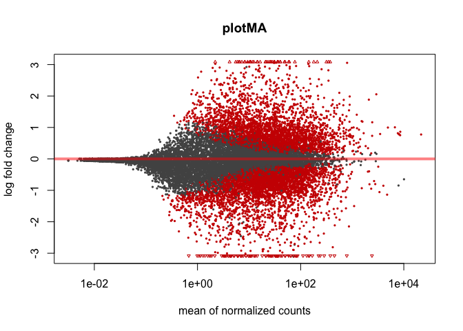
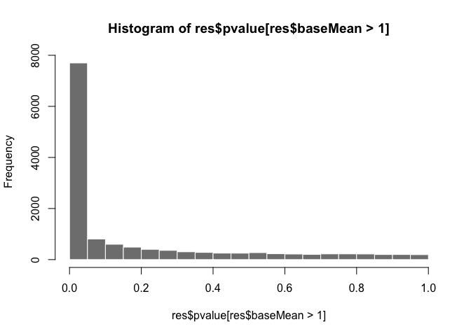
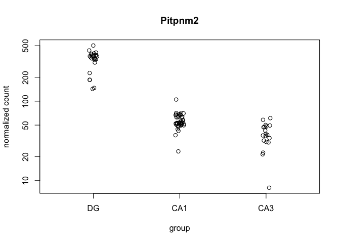
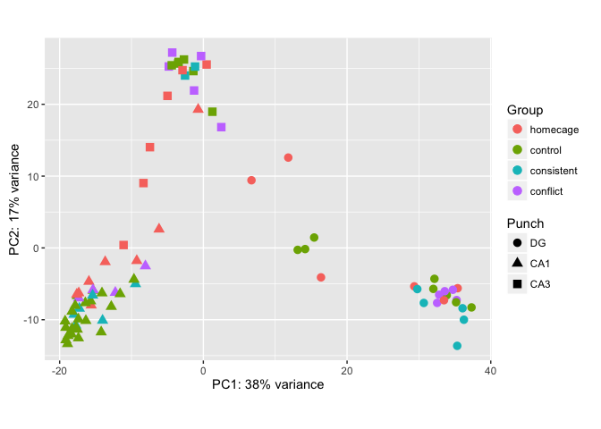
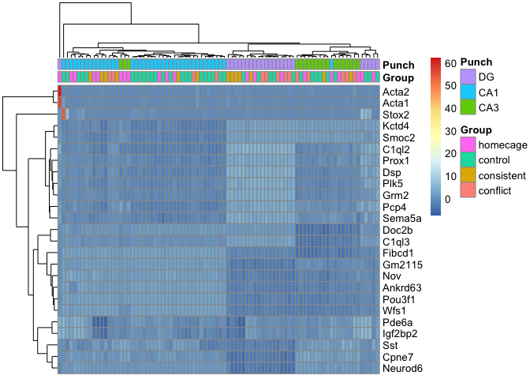

This will do a quick and dirty DESeq2 analysis for all samples!

    library("ggplot2") ## pretty plots
    library("DESeq2")
    library("genefilter") # for selecting top varying genes
    library("pheatmap") # for the pretty heatmap
    knitr::opts_chunk$set(fig.path = '../results/02c_DESeq2/') # set output file for figures 

    countData <- read.csv("../data/rnaseq/countbygene.csv", header=T)
    colData <- read.csv("../data/rnaseq/kallistosamples.csv", header=T)

    ## differential gene expression
    dds <- DESeqDataSetFromMatrix(countData = countData,
      colData = colData,
      design = ~ Group + Punch)
    dds

    ## class: DESeqDataSet 
    ## dim: 22485 84 
    ## metadata(1): version
    ## assays(1): counts
    ## rownames: NULL
    ## rowData names(0):
    ## colnames(84): X100.CA1.1 X100.CA1.2 ... X16.125D X16.126B
    ## colData names(14): RNAseqID Mouse ... Slice Date

    ## 1.3.6 Pre-filtering
    dds <- dds[ rowSums(counts(dds)) > 1, ]

    ## 1.3.7 Note on factor levels
    dds$Group <- factor(dds$Group, levels=c("homecage","control","consistent", "conflict"))
    dds$Punch <- factor(dds$Punch, levels=c("DG","CA1", "CA3"))

    ## 1.4  Differential expression analysi
    dds <- DESeq(dds)

    ## estimating size factors

    ## estimating dispersions

    ## gene-wise dispersion estimates

    ## mean-dispersion relationship

    ## final dispersion estimates

    ## fitting model and testing

    ## -- replacing outliers and refitting for 419 genes
    ## -- DESeq argument 'minReplicatesForReplace' = 7 
    ## -- original counts are preserved in counts(dds)

    ## estimating dispersions

    ## fitting model and testing

    # general deseq
    res <- results(dds, independentFiltering = F)
    resOrdered <- res[order(res$padj),]
    head(resOrdered,10)

    ## log2 fold change (MAP): Punch CA3 vs DG 
    ## Wald test p-value: Punch CA3 vs DG 
    ## DataFrame with 10 rows and 6 columns
    ##     baseMean log2FoldChange      lfcSE      stat        pvalue
    ##    <numeric>      <numeric>  <numeric> <numeric>     <numeric>
    ## 1  131.46173      -3.150645 0.10643901 -29.60048 1.473291e-192
    ## 2  451.31464      -5.142909 0.18553831 -27.71885 4.138535e-169
    ## 3   35.35761      -3.774262 0.16435824 -22.96363 1.076886e-116
    ## 4   33.23716       3.056081 0.13576965  22.50931 3.364847e-112
    ## 5   62.24927       1.642667 0.07837983  20.95778  1.593496e-97
    ## 6   32.04951      -3.636546 0.17424782 -20.86997  1.004063e-96
    ## 7   50.63976      -4.242708 0.20368517 -20.82974  2.327451e-96
    ## 8  161.43139       1.326908 0.06473924  20.49619  2.328473e-93
    ## 9   87.61710       1.598157 0.07850328  20.35784  3.956569e-92
    ## 10  32.57869      -5.014996 0.25198172 -19.90222  3.892873e-88
    ##             padj
    ##        <numeric>
    ## 1  2.669751e-188
    ## 2  3.749720e-165
    ## 3  6.504751e-113
    ## 4  1.524360e-108
    ## 5   5.775149e-94
    ## 6   3.032439e-93
    ## 7   6.025106e-93
    ## 8   5.274283e-90
    ## 9   7.966332e-89
    ## 10  7.054275e-85

    sum(res$padj < 0.1, na.rm = TRUE) 

    ## [1] 7728

    res05 <- results(dds, alpha=0.05)
    table(res05$padj < .05)

    ## 
    ## FALSE  TRUE 
    ##  8294  7063

    sum(res05$padj < 0.05, na.rm=TRUE)

    ## [1] 7063

    ## 1.5 exploring and reporting results

    plotMA(res, main="plotMA")

    resMLE <- results(dds)
    head(resMLE, 4)

    ## log2 fold change (MAP): Punch CA3 vs DG 
    ## Wald test p-value: Punch CA3 vs DG 
    ## DataFrame with 4 rows and 6 columns
    ##    baseMean log2FoldChange     lfcSE       stat      pvalue        padj
    ##   <numeric>      <numeric> <numeric>  <numeric>   <numeric>   <numeric>
    ## 1 19.935795      0.3612712 0.1719773  2.1006917 0.035668039 0.074418677
    ## 2  7.695465      0.6992462 0.2343186  2.9841685 0.002843501 0.008106872
    ## 3  4.333397      0.1289840 0.4223310  0.3054097 0.760054098 0.840031618
    ## 4 47.485288     -0.1254855 0.1537292 -0.8162761 0.414342256 0.544708324

    hist(res$pvalue[res$baseMean > 1], breaks=0:20/20, col="grey50", border="white")

    plotCounts(dds, gene=which.min(res$padj), intgroup="Group")

    plotCounts(dds, gene=which.min(res$padj), intgroup="Punch")

    respadj <- as.data.frame(res$padj)
    head(respadj)

    ##      res$padj
    ## 1 0.085938111
    ## 2 0.009361753
    ## 3 0.942464591
    ## 4 0.626557981
    ## 5 0.104536771
    ## 6 0.140214304

    ## 1.5 more info
    mcols(res)$description

    ## [1] "mean of normalized counts for all samples"
    ## [2] "log2 fold change (MAP): Punch CA3 vs DG"  
    ## [3] "standard error: Punch CA3 vs DG"          
    ## [4] "Wald statistic: Punch CA3 vs DG"          
    ## [5] "Wald test p-value: Punch CA3 vs DG"       
    ## [6] "BH adjusted p-values"

    ## for variance stablized gene expression and log transformed data
    rld <- rlog(dds, blind=FALSE)
    vsd <- varianceStabilizingTransformation(dds, blind=FALSE)
    vsd.fast <- vst(dds, blind=FALSE)
    head(assay(rld), 3)

    ##      X100.CA1.1 X100.CA1.2 X100.CA1.3 X100.CA3.1 X100.CA3.4 X100.DG.2
    ## [1,]   3.932139   4.163321   4.226501   4.519174   4.605758  4.692387
    ## [2,]   2.448453   3.011494   2.350548   2.959036   2.352084  2.988431
    ## [3,]   1.398761   2.251318   1.244991   2.276432   1.945824  1.498299
    ##      X100.DG.3 X101.CA1.1 X101.CA1.2 X101.CA1.3 X101.CA3.1 X101.CA3.4
    ## [1,]  4.521559   4.388604   3.419943   3.031694   4.587837   4.493653
    ## [2,]  2.827402   2.624750   3.448326   2.083238   3.212791   2.791334
    ## [3,]  2.466362   1.842397   1.517091   1.285338   2.126857   1.600464
    ##      X101.DG.3 X101.DG.4 X142C_CA1  X142C_DG X143A.CA3.1 X143A.DG.1
    ## [1,]  5.081577  3.566592 4.2729877 4.1756604    4.255030   4.084287
    ## [2,]  3.298009  1.865710 3.0419898 2.5807957    2.558152   2.481258
    ## [3,]  2.939508  2.991054 0.7327427 0.7610417    1.351489   1.520553
    ##      X143B.CA1.1 X143B.DG.1 X143C_CA1  X143C_DG X143C.CA1.1 X143D.CA1.3
    ## [1,]    4.608633   4.155500  3.445781 3.2855360    3.844327   4.2801098
    ## [2,]    2.929734   2.293982  2.434314 2.4127211    2.709410   1.6392028
    ## [3,]    2.311768   2.000015  1.183787 0.7749111    1.248150   0.9830986
    ##      X143D.DG.3 X144A.CA1.2 X144A.CA3.2 X144A.DG.2 X144B.CA1.1 X144B.CA3.1
    ## [1,]   4.799386    4.321712    5.002061  4.2968609    4.377277    4.553698
    ## [2,]   1.653698    2.812675    3.330484  1.9547126    2.377614    2.633211
    ## [3,]   1.585727    1.851882    2.840897  0.7917734    1.030722    1.994587
    ##      X144C.CA1.2 X144C.CA3.2 X144C.DG.2 X144D.CA3.2 X144D.DG.2 X145A.CA1.2
    ## [1,]    3.965666    4.212520   4.139846    4.025725   4.483338    4.372276
    ## [2,]    2.277458    3.400362   2.562006    2.379627   2.300765    2.604166
    ## [3,]    1.104249    1.910731   1.776877    2.055413   1.786678    2.134935
    ##      X145A.CA3.2 X145A.DG.2 X145B.CA1.1 X145B.DG.1 X146A.CA1.2 X146A.CA3.2
    ## [1,]    3.793771   4.346735    4.337545  3.6764804    3.848577    4.651757
    ## [2,]    3.262969   2.773097    2.671896  2.5384825    2.768171    2.088548
    ## [3,]    1.271721   1.206993    1.484871  0.9242021    2.153445    1.991589
    ##      X146A.DG.2 X146B.CA1.2 X146B.CA3.2 X146B.DG.2 X146C.CA1.4 X146C.DG.4
    ## [1,]   4.029602   3.5307402    3.739733   3.526896    4.409590   4.834768
    ## [2,]   2.349158   2.4273400    3.420823   2.410211    2.467048   2.917447
    ## [3,]   2.170644   0.9893119    1.272543   1.591860    2.428082   1.153537
    ##      X146D.CA1.3 X146D.CA3.3 X146D.DG.3 X147.CA1.4 X147.CA3.4 X147.DG.4
    ## [1,]    4.525101    4.454325   5.130646   3.910225   6.218182  3.491945
    ## [2,]    2.841196    2.663552   2.477744   2.902663   3.773645  4.282071
    ## [3,]    1.220135    1.713372   1.651483   1.485494   1.103181  1.566657
    ##      X147C.CA1.3 X147C.CA3.3 X147C.DG.3 X147D.CA3.1 X147D.DG.1 X148.CA1.2
    ## [1,]    4.108847    4.508291   3.983038    3.924944   4.275922   4.273185
    ## [2,]    2.329767    2.406190   2.765010    2.739889   2.708748   2.088473
    ## [3,]    1.131473    1.644032   1.145026    1.621165   2.326318   2.449814
    ##      X148.CA3.2 X148.DG.2 X148A.CA1.3 X148A.CA3.3 X148A.DG.3 X148B.CA1.4
    ## [1,]  4.2517918 3.9587118    4.250182    4.118921   4.301327    3.862326
    ## [2,]  3.3898100 2.5583215    2.892724    2.763277   2.173752    2.096668
    ## [3,]  0.8371026 0.8430774    1.844025    1.791935   1.803210    1.298148
    ##      X148B.CA3.4 X148B.DG.4 X16.116B  X16.117D X16.118B X16.118D X16.119B
    ## [1,]    4.658272   4.042304 3.949598 4.3292583 3.255535 3.969977 3.930436
    ## [2,]    3.039297   2.097192 2.789188 2.9016437 2.197874 2.871412 2.573096
    ## [3,]    1.915235   1.424834 1.717166 0.9302181 1.155927 2.125307 1.178329
    ##      X16.119D X16.120B  X16.120D X16.122B X16.122D X16.123B X16.123D
    ## [1,] 3.712358 3.448549 3.8799255 4.015208 4.084290 3.528304 3.877298
    ## [2,] 2.453672 2.381415 1.8412507 3.293855 2.789570 1.768072 2.550825
    ## [3,] 1.025564 1.298142 0.8465845 1.813849 1.556134 1.065735 1.596730
    ##      X16.124D X16.125B X16.125D X16.126B
    ## [1,] 3.775157 3.771076 3.713712 3.877117
    ## [2,] 2.757465 2.059480 2.307517 2.633457
    ## [3,] 1.349677 1.262998 0.857655 2.414020

pca plot
--------

    pcaData <- plotPCA(rld, intgroup = c( "Group", "Punch"), returnData=TRUE)
    pcaData

    ##                     PC1         PC2            group      Group Punch
    ## X100.CA1.1  -17.3362835  -6.2809893   homecage : CA1   homecage   CA1
    ## X100.CA1.2  -15.9288353  -4.6796354   homecage : CA1   homecage   CA1
    ## X100.CA1.3  -15.6105242  -7.9753308   homecage : CA1   homecage   CA1
    ## X100.CA3.1  -11.1016401   0.4022301   homecage : CA3   homecage   CA3
    ## X100.CA3.4   -7.4326171  14.0290123   homecage : CA3   homecage   CA3
    ## X100.DG.2    11.8180408  12.5801600    homecage : DG   homecage    DG
    ## X100.DG.3    35.3911946  -5.6105572    homecage : DG   homecage    DG
    ## X101.CA1.1  -13.6613609  -1.9387919   homecage : CA1   homecage   CA1
    ## X101.CA1.2   -6.1647963   2.6005837   homecage : CA1   homecage   CA1
    ## X101.CA1.3   -0.7207823  19.2765124   homecage : CA1   homecage   CA1
    ## X101.CA3.1   -8.3334923   9.0304738   homecage : CA3   homecage   CA3
    ## X101.CA3.4    0.4557497  25.5409153   homecage : CA3   homecage   CA3
    ## X101.DG.3     6.6974919   9.4218319    homecage : DG   homecage    DG
    ## X101.DG.4    29.3530110  -5.3531345    homecage : DG   homecage    DG
    ## X142C_CA1   -17.7550787 -10.7771067 consistent : CA1 consistent   CA1
    ## X142C_DG     35.3312283 -13.6363001  consistent : DG consistent    DG
    ## X143A.CA3.1  -4.8045130  25.2676462   conflict : CA3   conflict   CA3
    ## X143A.DG.1   34.7250140  -5.8286634    conflict : DG   conflict    DG
    ## X143B.CA1.1 -15.3394549  -5.9244301    control : CA1    control   CA1
    ## X143B.DG.1   32.1603916  -4.3024983     control : DG    control    DG
    ## X143C_CA1   -18.0001553  -9.2655588 consistent : CA1 consistent   CA1
    ## X143C_DG     29.7767936  -5.7335211  consistent : DG consistent    DG
    ## X143C.CA1.1 -17.2610936  -8.4239598 consistent : CA1 consistent   CA1
    ## X143D.CA1.3 -16.4249544  -7.6541575    control : CA1    control   CA1
    ## X143D.DG.3   32.0084195  -5.7048558     control : DG    control    DG
    ## X144A.CA1.2  -8.0647845  -2.5183643   conflict : CA1   conflict   CA1
    ## X144A.CA3.2  -1.2896578  21.9210008   conflict : CA3   conflict   CA3
    ## X144A.DG.2   35.2445761  -7.2622405    conflict : DG   conflict    DG
    ## X144B.CA1.1 -17.5541437  -6.6624231    control : CA1    control   CA1
    ## X144B.CA3.1   1.2554593  18.9671874    control : CA3    control   CA3
    ## X144C.CA1.2  -9.4414413  -5.0085277 consistent : CA1 consistent   CA1
    ## X144C.CA3.2  -2.5464331  24.0070501 consistent : CA3 consistent   CA3
    ## X144C.DG.2   36.2580682 -10.0014964  consistent : DG consistent    DG
    ## X144D.CA3.2  -2.6989469  26.2373857    control : CA3    control   CA3
    ## X144D.DG.2   35.1727560  -7.5655260     control : DG    control    DG
    ## X145A.CA1.2 -17.3609842  -6.9882053   conflict : CA1   conflict   CA1
    ## X145A.CA3.2   2.4997886  16.8179413   conflict : CA3   conflict   CA3
    ## X145A.DG.2   32.5351625  -7.6567449    conflict : DG   conflict    DG
    ## X145B.CA1.1 -15.6836263  -7.3937599    control : CA1    control   CA1
    ## X145B.DG.1   33.8688778  -6.5879823     control : DG    control    DG
    ## X146A.CA1.2 -15.3611815  -5.8522046   conflict : CA1   conflict   CA1
    ## X146A.CA3.2  -0.3140382  26.7182315   conflict : CA3   conflict   CA3
    ## X146A.DG.2   32.8175153  -6.5237132    conflict : DG   conflict    DG
    ## X146B.CA1.2 -12.8124769  -8.1692340    control : CA1    control   CA1
    ## X146B.CA3.2  -4.3964709  25.4331815    control : CA3    control   CA3
    ## X146B.DG.2   13.1289541  -0.2715960     control : DG    control    DG
    ## X146C.CA1.4 -14.0257039 -10.0981217 consistent : CA1 consistent   CA1
    ## X146C.DG.4   30.6795959  -7.6627175  consistent : DG consistent    DG
    ## X146D.CA1.3  -9.6575617  -4.3877493    control : CA1    control   CA1
    ## X146D.CA3.3  -1.3865306  24.6250110    control : CA3    control   CA3
    ## X146D.DG.3   14.1653133  -0.1597965     control : DG    control    DG
    ## X147.CA1.4   -9.2655988  -1.7841381   homecage : CA1   homecage   CA1
    ## X147.CA3.4   -4.9886483  21.1739310   homecage : CA3   homecage   CA3
    ## X147.DG.4    16.3729519  -4.1016022    homecage : DG   homecage    DG
    ## X147C.CA1.3 -15.4098488  -6.5968913 consistent : CA1 consistent   CA1
    ## X147C.CA3.3  -1.1565883  25.2510389 consistent : CA3 consistent   CA3
    ## X147C.DG.3   36.0712971  -8.4016540  consistent : DG consistent    DG
    ## X147D.CA3.1  -3.5024875  25.6809039    control : CA3    control   CA3
    ## X147D.DG.1   37.3229064  -8.2847286     control : DG    control    DG
    ## X148.CA1.2  -17.6132319  -6.4667235   homecage : CA1   homecage   CA1
    ## X148.CA3.2   -2.9007229  24.7555558   homecage : CA3   homecage   CA3
    ## X148.DG.2    33.4913106  -7.2869928    homecage : DG   homecage    DG
    ## X148A.CA1.3 -12.2503341  -6.2146731   conflict : CA1   conflict   CA1
    ## X148A.CA3.3  -4.3294077  27.2045671   conflict : CA3   conflict   CA3
    ## X148A.DG.3   33.5937740  -6.0321696    conflict : DG   conflict    DG
    ## X148B.CA1.4 -11.5860387  -6.4008406    control : CA1    control   CA1
    ## X148B.CA3.4  -3.4486153  25.8963950    control : CA3    control   CA3
    ## X148B.DG.4   15.4207746   1.4488446     control : DG    control    DG
    ## X16.116B    -18.2660519 -11.2324208    control : CA1    control   CA1
    ## X16.117D    -16.3505482 -10.1313619    control : CA1    control   CA1
    ## X16.118B    -19.1277750 -12.8164667    control : CA1    control   CA1
    ## X16.118D    -17.7273743 -11.0951294    control : CA1    control   CA1
    ## X16.119B    -19.1438576 -11.0893455    control : CA1    control   CA1
    ## X16.119D    -18.9006545 -13.3536651    control : CA1    control   CA1
    ## X16.120B    -18.8239395 -12.2257065    control : CA1    control   CA1
    ## X16.120D    -18.3572746 -12.0082534    control : CA1    control   CA1
    ## X16.122B    -17.3893341  -9.9238513    control : CA1    control   CA1
    ## X16.122D    -18.2805843  -8.8432354    control : CA1    control   CA1
    ## X16.123B    -14.1077360  -6.2887523    control : CA1    control   CA1
    ## X16.123D    -17.3872634 -12.5508669    control : CA1    control   CA1
    ## X16.124D    -19.2356125 -10.2022399    control : CA1    control   CA1
    ## X16.125B    -14.2181725 -11.7199691    control : CA1    control   CA1
    ## X16.125D    -17.5445089 -11.3424030    control : CA1    control   CA1
    ## X16.126B    -17.8346441  -8.0336168    control : CA1    control   CA1
    ##                    name
    ## X100.CA1.1   X100.CA1.1
    ## X100.CA1.2   X100.CA1.2
    ## X100.CA1.3   X100.CA1.3
    ## X100.CA3.1   X100.CA3.1
    ## X100.CA3.4   X100.CA3.4
    ## X100.DG.2     X100.DG.2
    ## X100.DG.3     X100.DG.3
    ## X101.CA1.1   X101.CA1.1
    ## X101.CA1.2   X101.CA1.2
    ## X101.CA1.3   X101.CA1.3
    ## X101.CA3.1   X101.CA3.1
    ## X101.CA3.4   X101.CA3.4
    ## X101.DG.3     X101.DG.3
    ## X101.DG.4     X101.DG.4
    ## X142C_CA1     X142C_CA1
    ## X142C_DG       X142C_DG
    ## X143A.CA3.1 X143A.CA3.1
    ## X143A.DG.1   X143A.DG.1
    ## X143B.CA1.1 X143B.CA1.1
    ## X143B.DG.1   X143B.DG.1
    ## X143C_CA1     X143C_CA1
    ## X143C_DG       X143C_DG
    ## X143C.CA1.1 X143C.CA1.1
    ## X143D.CA1.3 X143D.CA1.3
    ## X143D.DG.3   X143D.DG.3
    ## X144A.CA1.2 X144A.CA1.2
    ## X144A.CA3.2 X144A.CA3.2
    ## X144A.DG.2   X144A.DG.2
    ## X144B.CA1.1 X144B.CA1.1
    ## X144B.CA3.1 X144B.CA3.1
    ## X144C.CA1.2 X144C.CA1.2
    ## X144C.CA3.2 X144C.CA3.2
    ## X144C.DG.2   X144C.DG.2
    ## X144D.CA3.2 X144D.CA3.2
    ## X144D.DG.2   X144D.DG.2
    ## X145A.CA1.2 X145A.CA1.2
    ## X145A.CA3.2 X145A.CA3.2
    ## X145A.DG.2   X145A.DG.2
    ## X145B.CA1.1 X145B.CA1.1
    ## X145B.DG.1   X145B.DG.1
    ## X146A.CA1.2 X146A.CA1.2
    ## X146A.CA3.2 X146A.CA3.2
    ## X146A.DG.2   X146A.DG.2
    ## X146B.CA1.2 X146B.CA1.2
    ## X146B.CA3.2 X146B.CA3.2
    ## X146B.DG.2   X146B.DG.2
    ## X146C.CA1.4 X146C.CA1.4
    ## X146C.DG.4   X146C.DG.4
    ## X146D.CA1.3 X146D.CA1.3
    ## X146D.CA3.3 X146D.CA3.3
    ## X146D.DG.3   X146D.DG.3
    ## X147.CA1.4   X147.CA1.4
    ## X147.CA3.4   X147.CA3.4
    ## X147.DG.4     X147.DG.4
    ## X147C.CA1.3 X147C.CA1.3
    ## X147C.CA3.3 X147C.CA3.3
    ## X147C.DG.3   X147C.DG.3
    ## X147D.CA3.1 X147D.CA3.1
    ## X147D.DG.1   X147D.DG.1
    ## X148.CA1.2   X148.CA1.2
    ## X148.CA3.2   X148.CA3.2
    ## X148.DG.2     X148.DG.2
    ## X148A.CA1.3 X148A.CA1.3
    ## X148A.CA3.3 X148A.CA3.3
    ## X148A.DG.3   X148A.DG.3
    ## X148B.CA1.4 X148B.CA1.4
    ## X148B.CA3.4 X148B.CA3.4
    ## X148B.DG.4   X148B.DG.4
    ## X16.116B       X16.116B
    ## X16.117D       X16.117D
    ## X16.118B       X16.118B
    ## X16.118D       X16.118D
    ## X16.119B       X16.119B
    ## X16.119D       X16.119D
    ## X16.120B       X16.120B
    ## X16.120D       X16.120D
    ## X16.122B       X16.122B
    ## X16.122D       X16.122D
    ## X16.123B       X16.123B
    ## X16.123D       X16.123D
    ## X16.124D       X16.124D
    ## X16.125B       X16.125B
    ## X16.125D       X16.125D
    ## X16.126B       X16.126B

    percentVar <- round(100 * attr(pcaData, "percentVar"))

    ggplot(pcaData, aes(PC1, PC2, color=Group, shape = Punch)) + geom_point(size=3) +
    xlab(paste0("PC1: ",percentVar[1],"% variance")) +
    ylab(paste0("PC2: ",percentVar[2],"% variance")) +
    coord_fixed()

    topVarGenes <- head(order(rowVars(assay(rld)),decreasing=TRUE),25)
    mat <- assay(rld)[ topVarGenes, ]
    mat <- mat - rowMeans(mat)
    df <- as.data.frame(colData(rld)[,c("Group", "Punch")])
    pheatmap(mat, show_colnames=F, show_rownames = T,
    annotation_col=df)

Session Info
------------

    sessionInfo()

    ## R version 3.3.1 (2016-06-21)
    ## Platform: x86_64-apple-darwin13.4.0 (64-bit)
    ## Running under: OS X 10.10.5 (Yosemite)
    ## 
    ## locale:
    ## [1] en_US.UTF-8/en_US.UTF-8/en_US.UTF-8/C/en_US.UTF-8/en_US.UTF-8
    ## 
    ## attached base packages:
    ## [1] parallel  stats4    stats     graphics  grDevices utils     datasets 
    ## [8] methods   base     
    ## 
    ## other attached packages:
    ##  [1] pheatmap_1.0.8             genefilter_1.56.0         
    ##  [3] DESeq2_1.14.0              SummarizedExperiment_1.4.0
    ##  [5] Biobase_2.34.0             GenomicRanges_1.26.1      
    ##  [7] GenomeInfoDb_1.10.1        IRanges_2.8.0             
    ##  [9] S4Vectors_0.12.0           BiocGenerics_0.20.0       
    ## [11] ggplot2_2.1.0             
    ## 
    ## loaded via a namespace (and not attached):
    ##  [1] locfit_1.5-9.1       splines_3.3.1        lattice_0.20-34     
    ##  [4] colorspace_1.2-7     htmltools_0.3.5      yaml_2.1.14         
    ##  [7] chron_2.3-47         survival_2.40-1      XML_3.98-1.4        
    ## [10] foreign_0.8-67       DBI_0.5-1            BiocParallel_1.8.1  
    ## [13] RColorBrewer_1.1-2   plyr_1.8.4           stringr_1.1.0       
    ## [16] zlibbioc_1.20.0      munsell_0.4.3        gtable_0.2.0        
    ## [19] evaluate_0.10        labeling_0.3         latticeExtra_0.6-28 
    ## [22] knitr_1.15.1         geneplotter_1.52.0   AnnotationDbi_1.36.0
    ## [25] htmlTable_1.7        Rcpp_0.12.7          acepack_1.4.1       
    ## [28] xtable_1.8-2         scales_0.4.0         backports_1.0.5     
    ## [31] Hmisc_4.0-0          annotate_1.52.0      XVector_0.14.0      
    ## [34] gridExtra_2.2.1      digest_0.6.11        stringi_1.1.2       
    ## [37] grid_3.3.1           rprojroot_1.2        tools_3.3.1         
    ## [40] bitops_1.0-6         magrittr_1.5         RCurl_1.95-4.8      
    ## [43] RSQLite_1.0.0        Formula_1.2-1        cluster_2.0.5       
    ## [46] Matrix_1.2-7.1       data.table_1.9.6     rmarkdown_1.3       
    ## [49] rpart_4.1-10         nnet_7.3-12
