Loading the data
----------------

In the summer of 2016, I processed a bunch of hippocampal tissue samples
from WT and FMR1-KO mice that were trained in an active place avoidance
task.

This data was added the the epically large sample collection database
contained in the two files "animals.csv" and "punches.csv" which
provided a detailed account of all animals processed and all tissue
samples collected. Then, I tidy the dataframe a little bit to get it
prepared for RNAseq sample submision.

    #install.packages("tidyr", dependencies=TRUE)
    library("tidyr") 
    library("dplyr") ## for filtering and selecting rows
    library("plyr")  ## for renmaing factors
    library("reshape2") ##  for melting dataframe
    library("ggplot2") ## for awesome plots!
    library("magrittr") ## to use the weird pipe
    library("gplots") ##for making awesome plots
    library("cowplot") ## for some easy to use themes
    library("DESeq2") ## for differnetial gene expression profiling

    #read raw data -----
    punches <- read.csv("../data/rnaseq/punches.csv", header=TRUE)
    animals <- read.csv("../data/rnaseq/animals.csv", header=TRUE)

    #combine mine and maddy's notes -----
    full <- join(animals, punches, by = "Mouse", type = "full", match = "all")

Subsetting the data
-------------------

This analysis will focus only on the anaimals process in 2016. I
collected many, many samples, but I only processed a subset. I conducted
a photo anlaysis first to decide which samples came from a very specific
location in the hippocampus.

    ############# Summer 2016 Samples for RNAseq
    ## first, make a spreadsheet for recording photo analysis 
    summer2016photos <- full %>%
      filter(Year == "Summer2016", Purpose == "Collaboratorium") %>%
      distinct(Mouse, Slice) %>% droplevels()
    # This output was saved as a file and used for doing the photo analysis

    ## then, use the allen brain atlast to annotate the photos
    ## then read in photo results 
    summer2016photos <- read.csv("../data/rnaseq/summer2016photos.csv", header=T, stringsAsFactors = F)

    ## subset the full punch dataset and keep the relevant columns for the 2016 project
    summer2016forRNAseq <- full %>%
      filter(Year == "Summer2016", Purpose == "Collaboratorium") %>%
      distinct(Tube, Mouse, Genotype, Group, Punch, Slice, Date, storagebox) %>% droplevels()

    ## merge the photo and the punch data
    summer2016forRNAseq <- join(summer2016forRNAseq, summer2016photos, by=c("Mouse","Slice"), type = "full", match = "all")
    summer2016forRNAseq$Slice <- as.integer(summer2016forRNAseq$Slice) # first make both integers
    #str(summer2016forRNAseq)
    rm(summer2016photos) #don't need this anymore

    # reset the Groups to be Yoked, Same, and Conflict
    summer2016forRNAseq <- rename(summer2016forRNAseq, c("Group"="APA"))
    summer2016forRNAseq$APA <- ifelse(grepl("NoConflict Trained", summer2016forRNAseq$APA), "Same", 
                                      ifelse(grepl("Yoked", summer2016forRNAseq$APA), "Yoked", "Conflict"))
    #summer2016forRNAseq$APA

    ## create a T/F column to say if the the same is from the optimal slice or not. 
    summer2016forRNAseq$isbest <- ifelse(summer2016forRNAseq$Slice == summer2016forRNAseq$sliceforRNAseq, T,F) 

    ## filter data to only the BEST slices and CA1, CA3, and DG Samples
    summer2016forRNAseq <- summer2016forRNAseq %>%
      filter(isbest == "TRUE") %>% filter(Punch %in% c("CA1")) %>% 
      filter(APA == "Yoked") %>% 
      arrange(Date) %>% droplevels()

    ## create an RNAseqID (can't have dashes, must be less than 10 characters)
    #head(summer2016forRNAseq)
    summer2016forRNAseq$idealRNAseqID <- as.factor(paste(summer2016forRNAseq$Mouse,summer2016forRNAseq$Slice,sep="_"))
    summer2016forRNAseq$idealRNAseqID <- gsub("-", "_", summer2016forRNAseq$idealRNAseqID, fixed = TRUE)
    summer2016forRNAseq$RNAseqID <- summer2016forRNAseq$Mouse

    ### calculate sample sizes
    summer2016forRNAseqtotals <- select(summer2016forRNAseq, Genotype, APA, Punch)
    summer2016forRNAseqtotals <- count(summer2016forRNAseqtotals, c('Genotype','APA', "Punch"))
    summer2016forRNAseqtotals <- dcast(summer2016forRNAseqtotals, Genotype + APA ~ Punch, value.var = "freq")
    rm(summer2016forRNAseqtotals)

Data Cleaning
-------------

Well, the words I used when collecting might not be exactly what I want
plotted on figures and such, so I need to do a little data cleaning. I
also need to get the data in order so that row names are informative and
contain information

    ## start after 02c_tpmbygene
    Traits <- summer2016forRNAseq
    rownames(Traits) <- Traits$RNAseqID    # set $genoAPAsessionInd as rownames
    #names(Traits)

    #keeping informative volumns
    Traits <- Traits[c(2,3,4,5,9,14)] 
    str(Traits)

    ## 'data.frame':    17 obs. of  6 variables:
    ##  $ Mouse        : chr  "16-122B" "16-122D" "16-116B" "16-126B" ...
    ##  $ Genotype     : Factor w/ 2 levels "FMR1","WT": 2 2 1 2 1 2 2 1 1 1 ...
    ##  $ APA          : chr  "Yoked" "Yoked" "Yoked" "Yoked" ...
    ##  $ Punch        : Factor w/ 1 level "CA1": 1 1 1 1 1 1 1 1 1 1 ...
    ##  $ atlaslocation: int  74 74 74 74 74 74 74 NA 74 74 ...
    ##  $ RNAseqID     : chr  "16-122B" "16-122D" "16-116B" "16-126B" ...

RNAseq basic statistics
-----------------------

These 17 samples were processed according to the workflow descibed in:
<https://github.com/raynamharris/SingleNeuronSeq_bin>

Here, I provide a brief overview of the number of reads that survived
after trimming and filters, the number of reads that were pseduoaligned,
and the average read length. This particiular anlysis is sample
agnostic.

You can see that all reads are between 223- 238 bp long. A samples had
2.8 -4.7 million reads, but only 0.25-3.2 million reads mapped to the
mouse transciptome. Mapping efficiency has 57-77 percent for most
samples, but one only had 6% mapping efficiency. THis sample will likely
need to be removed.

    readsprocessed <- read.table("../data/rnaseq/JA17009readsprocessed.txt", sep="\t", header=TRUE, stringsAs = FALSE)
    readsprocessed$percentaligned <- readsprocessed$pseudoaligned / readsprocessed$trimmedreads *100
    summary(readsprocessed)

    ##   trimmedreads     pseudoaligned         length      percentaligned  
    ##  Min.   :2821442   Min.   : 256779   Min.   :223.9   Min.   : 6.719  
    ##  1st Qu.:3465927   1st Qu.:2054499   1st Qu.:227.1   1st Qu.:57.307  
    ##  Median :3682043   Median :2551688   Median :230.9   Median :66.194  
    ##  Mean   :3723937   Mean   :2139308   Mean   :230.6   Mean   :57.835  
    ##  3rd Qu.:4114235   3rd Qu.:2700786   3rd Qu.:232.8   3rd Qu.:70.447  
    ##  Max.   :4667492   Max.   :3203138   Max.   :237.4   Max.   :77.924

Kallisto Gather
---------------

The kallisto output gives you read counts for sample in an abundance
file for every single sample. This portion of the code goes through and
finds each samples' abundance.tsv file, extracts the data, and combines
it all into a dataframe. The "counts" file is unnormalized, but the
"tpm" is the data after being normalized by transcripts per million. I
also use some string splitting to take the very long transcript
identifying and create a "geneids" file that has all the database
identifiers for each transcript.

(P.S. Unfortunately, I have no idea how to do this next part without
changing directories.)

    setwd("../TACC-copy/JA17009/04_kallistoquant/")
    ## this will create lists of all the samples
    kallistoDirs = dir(".")
    kallistoDirs = kallistoDirs[!grepl("\\.(R|py|pl|sh|xlsx?|txt|tsv|csv|org|md|obo|png|jpg|pdf)$",
            kallistoDirs, ignore.case=TRUE)]

    kallistoFiles = paste0(kallistoDirs, "/abundance.tsv")
    names(kallistoFiles) = kallistoDirs
    if(file.exists(kallistoFiles))
      kallistoData = lapply(
        kallistoFiles,
        read.table,
        sep = "\t",
        row.names = 1,
        header = TRUE
    )

    ## Warning in if (file.exists(kallistoFiles)) kallistoData =
    ## lapply(kallistoFiles, : the condition has length > 1 and only the first
    ## element will be used

    ## this for loop uses the reduce function to make two data frame with counts or tpm from all the samples
    ids = Reduce(f=union, x=lapply(kallistoData, rownames))
    if (all(sapply(kallistoData, function(x) {all(rownames(x)==ids)}))) {
        count = data.frame(
            id = ids,
            sapply(kallistoData, function(x) {x$est_counts}),
            check.names = FALSE,
            stringsAsFactors = FALSE
        )
        tpm = data.frame(
            id = ids,
            sapply(kallistoData, function(x) {x$tpm}),
            check.names = FALSE,
            stringsAsFactors = FALSE
        )
    }

    ## make a dataframe with the parts of the gene id as columns
    geneids <- count[c(1)] 
    geneids$ENSMUST <- sapply(strsplit(as.character(geneids$id),'\\|'), "[", 1)
    geneids$ENSMUSG <- sapply(strsplit(as.character(geneids$id),'\\|'), "[", 2)
    geneids$OTTMUSG <- sapply(strsplit(as.character(geneids$id),'\\|'), "[", 3)
    geneids$OTTMUST <- sapply(strsplit(as.character(geneids$id),'\\|'), "[", 4)
    geneids$transcript <- sapply(strsplit(as.character(geneids$id),'\\|'), "[", 5)
    geneids$gene <- sapply(strsplit(as.character(geneids$id),'\\|'), "[", 6)
    geneids$length <- sapply(strsplit(as.character(geneids$id),'\\|'), "[", 7)
    geneids$structure1 <- sapply(strsplit(as.character(geneids$id),'\\|'), "[", 8)
    geneids$structure2 <- sapply(strsplit(as.character(geneids$id),'\\|'), "[", 9)
    geneids$structure3 <- sapply(strsplit(as.character(geneids$id),'\\|'), "[", 10)
    geneids$transcript_lenght <- as.factor(paste(geneids$transcript, geneids$length, sep="_"))

    ## prep data for wgcna
    countswgcna <- count
    row.names(countswgcna) <- geneids$transcript_lenght
    countswgcna[1] <- NULL
    countswgcna <- round(countswgcna)
    summary(countswgcna)

    ##     16-116B            16-116D            16-117D        
    ##  Min.   :    0.00   Min.   :    0.00   Min.   :    0.00  
    ##  1st Qu.:    0.00   1st Qu.:    0.00   1st Qu.:    0.00  
    ##  Median :    0.00   Median :    0.00   Median :    0.00  
    ##  Mean   :   35.47   Mean   :    4.37   Mean   :   24.49  
    ##  3rd Qu.:   11.00   3rd Qu.:    0.00   3rd Qu.:    8.00  
    ##  Max.   :23015.00   Max.   :51919.00   Max.   :18898.00  
    ##     16-118B            16-118D            16-119B        
    ##  Min.   :    0.00   Min.   :    0.00   Min.   :    0.00  
    ##  1st Qu.:    0.00   1st Qu.:    0.00   1st Qu.:    0.00  
    ##  Median :    0.00   Median :    0.00   Median :    0.00  
    ##  Mean   :   49.45   Mean   :   37.33   Mean   :   44.62  
    ##  3rd Qu.:   16.00   3rd Qu.:   13.00   3rd Qu.:   14.00  
    ##  Max.   :15698.00   Max.   :15547.00   Max.   :20043.00  
    ##     16-119D            16-120B            16-120D        
    ##  Min.   :    0.00   Min.   :    0.00   Min.   :    0.00  
    ##  1st Qu.:    0.00   1st Qu.:    0.00   1st Qu.:    0.00  
    ##  Median :    0.00   Median :    0.00   Median :    0.00  
    ##  Mean   :   44.17   Mean   :   48.87   Mean   :   37.38  
    ##  3rd Qu.:   14.00   3rd Qu.:   16.00   3rd Qu.:   11.00  
    ##  Max.   :13698.00   Max.   :21743.00   Max.   :21114.00  
    ##     16-122B            16-122D            16-123B        
    ##  Min.   :    0.00   Min.   :    0.00   Min.   :    0.00  
    ##  1st Qu.:    0.00   1st Qu.:    0.00   1st Qu.:    0.00  
    ##  Median :    0.00   Median :    0.00   Median :    0.00  
    ##  Mean   :   47.32   Mean   :   54.55   Mean   :   14.42  
    ##  3rd Qu.:   16.00   3rd Qu.:   18.00   3rd Qu.:    3.00  
    ##  Max.   :21913.00   Max.   :21640.00   Max.   :33189.00  
    ##     16-123D            16-124D            16-125B        
    ##  Min.   :    0.00   Min.   :    0.00   Min.   :    0.00  
    ##  1st Qu.:    0.00   1st Qu.:    0.00   1st Qu.:    0.00  
    ##  Median :    0.00   Median :    0.00   Median :    0.00  
    ##  Mean   :   43.46   Mean   :   44.21   Mean   :    8.27  
    ##  3rd Qu.:   15.00   3rd Qu.:   14.00   3rd Qu.:    2.00  
    ##  Max.   :16867.00   Max.   :22218.00   Max.   :90359.00  
    ##     16-125D            16-126B        
    ##  Min.   :    0.00   Min.   :    0.00  
    ##  1st Qu.:    0.00   1st Qu.:    0.00  
    ##  Median :    0.00   Median :    0.00  
    ##  Mean   :   34.99   Mean   :   45.99  
    ##  3rd Qu.:   12.00   3rd Qu.:   16.00  
    ##  Max.   :13073.00   Max.   :24322.00

    ## prep data for wgcna
    tpmswgcna <- tpm
    row.names(tpmswgcna) <- geneids$transcript_lenght
    tpmswgcna[1] <- NULL
    tpmswgcna <- round(tpmswgcna)
    summary(tpmswgcna)

    ##     16-116B            16-116D             16-117D        
    ##  Min.   :    0.00   Min.   :     0.00   Min.   :    0.00  
    ##  1st Qu.:    0.00   1st Qu.:     0.00   1st Qu.:    0.00  
    ##  Median :    0.00   Median :     0.00   Median :    0.00  
    ##  Mean   :   17.03   Mean   :    17.03   Mean   :   17.03  
    ##  3rd Qu.:    8.00   3rd Qu.:     0.00   3rd Qu.:    8.00  
    ##  Max.   :54046.00   Max.   :215104.00   Max.   :35992.00  
    ##     16-118B            16-118D            16-119B        
    ##  Min.   :    0.00   Min.   :    0.00   Min.   :    0.00  
    ##  1st Qu.:    0.00   1st Qu.:    0.00   1st Qu.:    0.00  
    ##  Median :    0.00   Median :    0.00   Median :    0.00  
    ##  Mean   :   17.03   Mean   :   17.03   Mean   :   17.03  
    ##  3rd Qu.:    9.00   3rd Qu.:    8.00   3rd Qu.:    7.00  
    ##  Max.   :22172.00   Max.   :12942.00   Max.   :14617.00  
    ##     16-119D            16-120B            16-120D        
    ##  Min.   :    0.00   Min.   :    0.00   Min.   :    0.00  
    ##  1st Qu.:    0.00   1st Qu.:    0.00   1st Qu.:    0.00  
    ##  Median :    0.00   Median :    0.00   Median :    0.00  
    ##  Mean   :   17.03   Mean   :   17.03   Mean   :   17.03  
    ##  3rd Qu.:    9.00   3rd Qu.:    8.00   3rd Qu.:    8.00  
    ##  Max.   :21162.00   Max.   :43054.00   Max.   :41812.00  
    ##     16-122B            16-122D            16-123B         
    ##  Min.   :    0.00   Min.   :    0.00   Min.   :     0.00  
    ##  1st Qu.:    0.00   1st Qu.:    0.00   1st Qu.:     0.00  
    ##  Median :    0.00   Median :    0.00   Median :     0.00  
    ##  Mean   :   17.03   Mean   :   17.03   Mean   :    17.03  
    ##  3rd Qu.:    8.00   3rd Qu.:    8.00   3rd Qu.:     3.00  
    ##  Max.   :15864.00   Max.   :13117.00   Max.   :169061.00  
    ##     16-123D            16-124D            16-125B          16-125D        
    ##  Min.   :    0.00   Min.   :    0.00   Min.   :     0   Min.   :    0.00  
    ##  1st Qu.:    0.00   1st Qu.:    0.00   1st Qu.:     0   1st Qu.:    0.00  
    ##  Median :    0.00   Median :    0.00   Median :     0   Median :    0.00  
    ##  Mean   :   17.03   Mean   :   17.03   Mean   :    17   Mean   :   17.03  
    ##  3rd Qu.:    9.00   3rd Qu.:    8.00   3rd Qu.:     3   3rd Qu.:    8.00  
    ##  Max.   :19103.00   Max.   :29286.00   Max.   :547257   Max.   :27181.00  
    ##     16-126B        
    ##  Min.   :    0.00  
    ##  1st Qu.:    0.00  
    ##  Median :    0.00  
    ##  Mean   :   17.03  
    ##  3rd Qu.:    7.00  
    ##  Max.   :16647.00

Merge transcipts counts to gene counts
--------------------------------------

Kallisto is cool because it does give you transcript level stuff, but
right now I think I have more power if I just look at gene level stuff.
I'll go back and look at transcripts if I want to.

    # merge tpm and gene id dataframe
    tpmbygene <-  full_join(geneids, tpm)

    ## Joining, by = "id"

    str(tpmbygene)

    ## 'data.frame':    58716 obs. of  29 variables:
    ##  $ id               : chr  "ENSMUST00000070533.4|ENSMUSG00000051951.5|OTTMUSG00000026353.2|OTTMUST00000065166.1|Xkr4-001|Xkr4|3634|UTR5:1-150|CDS:151-2094|"| __truncated__ "ENSMUST00000208660.1|ENSMUSG00000025900.11|OTTMUSG00000049985.3|OTTMUST00000145515.1|Rp1-003|Rp1|4170|UTR5:1-54|CDS:55-4170|" "ENSMUST00000027032.5|ENSMUSG00000025900.11|OTTMUSG00000049985.3|OTTMUST00000127195.2|Rp1-001|Rp1|6869|UTR5:1-127|CDS:128-6415|U"| __truncated__ "ENSMUST00000194992.6|ENSMUSG00000109048.1|-|-|Rp1-201|Rp1|858|CDS:1-858|" ...
    ##  $ ENSMUST          : chr  "ENSMUST00000070533.4" "ENSMUST00000208660.1" "ENSMUST00000027032.5" "ENSMUST00000194992.6" ...
    ##  $ ENSMUSG          : chr  "ENSMUSG00000051951.5" "ENSMUSG00000025900.11" "ENSMUSG00000025900.11" "ENSMUSG00000109048.1" ...
    ##  $ OTTMUSG          : chr  "OTTMUSG00000026353.2" "OTTMUSG00000049985.3" "OTTMUSG00000049985.3" "-" ...
    ##  $ OTTMUST          : chr  "OTTMUST00000065166.1" "OTTMUST00000145515.1" "OTTMUST00000127195.2" "-" ...
    ##  $ transcript       : chr  "Xkr4-001" "Rp1-003" "Rp1-001" "Rp1-201" ...
    ##  $ gene             : chr  "Xkr4" "Rp1" "Rp1" "Rp1" ...
    ##  $ length           : chr  "3634" "4170" "6869" "858" ...
    ##  $ structure1       : chr  "UTR5:1-150" "UTR5:1-54" "UTR5:1-127" "CDS:1-858" ...
    ##  $ structure2       : chr  "CDS:151-2094" "CDS:55-4170" "CDS:128-6415" NA ...
    ##  $ structure3       : chr  "UTR3:2095-3634" NA "UTR3:6416-6869" NA ...
    ##  $ transcript_lenght: Factor w/ 58716 levels "0610007P14Rik-001_1169",..: 56602 43155 43154 43156 47712 47716 47715 47713 47718 47717 ...
    ##  $ 16-116B          : num  48.1 0 0 0 0 ...
    ##  $ 16-116D          : num  0 0 0 0 0 0 0 0 0 0 ...
    ##  $ 16-117D          : num  41.189 0 0.255 0 0 ...
    ##  $ 16-118B          : num  48.9 0 0 0 0 ...
    ##  $ 16-118D          : num  44.6 0 0 0 0 ...
    ##  $ 16-119B          : num  24.2 0 0 0 0 ...
    ##  $ 16-119D          : num  64.5 0 0 0 0 ...
    ##  $ 16-120B          : num  39.3 0 0 0 0 ...
    ##  $ 16-120D          : num  27.8 0 0 0 0 ...
    ##  $ 16-122B          : num  29.1 0 0 0 0 ...
    ##  $ 16-122D          : num  37.659 0.183 0 0 0 ...
    ##  $ 16-123B          : num  40.4 0 0 0 0 ...
    ##  $ 16-123D          : num  44.6 0 0 0 0 ...
    ##  $ 16-124D          : num  40.9 0 0 0 0 ...
    ##  $ 16-125B          : num  9.43 0 0 0 0 ...
    ##  $ 16-125D          : num  48.5 0 0 0 0 ...
    ##  $ 16-126B          : num  24.595 0.202 0 0 0 ...

    head(tpmbygene)

    ##                                                                                                                                                    id
    ## 1      ENSMUST00000070533.4|ENSMUSG00000051951.5|OTTMUSG00000026353.2|OTTMUST00000065166.1|Xkr4-001|Xkr4|3634|UTR5:1-150|CDS:151-2094|UTR3:2095-3634|
    ## 2                        ENSMUST00000208660.1|ENSMUSG00000025900.11|OTTMUSG00000049985.3|OTTMUST00000145515.1|Rp1-003|Rp1|4170|UTR5:1-54|CDS:55-4170|
    ## 3       ENSMUST00000027032.5|ENSMUSG00000025900.11|OTTMUSG00000049985.3|OTTMUST00000127195.2|Rp1-001|Rp1|6869|UTR5:1-127|CDS:128-6415|UTR3:6416-6869|
    ## 4                                                                            ENSMUST00000194992.6|ENSMUSG00000109048.1|-|-|Rp1-201|Rp1|858|CDS:1-858|
    ## 5 ENSMUST00000027035.9|ENSMUSG00000025902.13|OTTMUSG00000050014.7|OTTMUST00000127245.2|Sox17-001|Sox17|3127|UTR5:1-1082|CDS:1083-2342|UTR3:2343-3127|
    ## 6   ENSMUST00000195555.1|ENSMUSG00000025902.13|OTTMUSG00000050014.7|OTTMUST00000127249.1|Sox17-005|Sox17|1977|UTR5:1-635|CDS:636-1511|UTR3:1512-1977|
    ##                ENSMUST               ENSMUSG              OTTMUSG
    ## 1 ENSMUST00000070533.4  ENSMUSG00000051951.5 OTTMUSG00000026353.2
    ## 2 ENSMUST00000208660.1 ENSMUSG00000025900.11 OTTMUSG00000049985.3
    ## 3 ENSMUST00000027032.5 ENSMUSG00000025900.11 OTTMUSG00000049985.3
    ## 4 ENSMUST00000194992.6  ENSMUSG00000109048.1                    -
    ## 5 ENSMUST00000027035.9 ENSMUSG00000025902.13 OTTMUSG00000050014.7
    ## 6 ENSMUST00000195555.1 ENSMUSG00000025902.13 OTTMUSG00000050014.7
    ##                OTTMUST transcript  gene length  structure1    structure2
    ## 1 OTTMUST00000065166.1   Xkr4-001  Xkr4   3634  UTR5:1-150  CDS:151-2094
    ## 2 OTTMUST00000145515.1    Rp1-003   Rp1   4170   UTR5:1-54   CDS:55-4170
    ## 3 OTTMUST00000127195.2    Rp1-001   Rp1   6869  UTR5:1-127  CDS:128-6415
    ## 4                    -    Rp1-201   Rp1    858   CDS:1-858          <NA>
    ## 5 OTTMUST00000127245.2  Sox17-001 Sox17   3127 UTR5:1-1082 CDS:1083-2342
    ## 6 OTTMUST00000127249.1  Sox17-005 Sox17   1977  UTR5:1-635  CDS:636-1511
    ##       structure3 transcript_lenght 16-116B 16-116D   16-117D 16-118B
    ## 1 UTR3:2095-3634     Xkr4-001_3634 48.0911       0 41.189300 48.9187
    ## 2           <NA>      Rp1-003_4170  0.0000       0  0.000000  0.0000
    ## 3 UTR3:6416-6869      Rp1-001_6869  0.0000       0  0.254695  0.0000
    ## 4           <NA>       Rp1-201_858  0.0000       0  0.000000  0.0000
    ## 5 UTR3:2343-3127    Sox17-001_3127  0.0000       0  0.000000  0.0000
    ## 6 UTR3:1512-1977    Sox17-005_1977  0.0000       0  0.000000  0.0000
    ##   16-118D 16-119B 16-119D  16-120B 16-120D 16-122B   16-122D 16-123B
    ## 1 44.6294 24.1652 64.5483 39.28090 27.8433 29.1028 37.658600 40.4018
    ## 2  0.0000  0.0000  0.0000  0.00000  0.0000  0.0000  0.182739  0.0000
    ## 3  0.0000  0.0000  0.0000  0.00000  0.0000  0.0000  0.000000  0.0000
    ## 4  0.0000  0.0000  0.0000  0.00000  0.0000  0.0000  0.000000  0.0000
    ## 5  0.0000  0.0000  0.0000  0.00000  0.0000  0.0000  0.000000  0.0000
    ## 6  0.0000  0.0000  0.0000  1.12541  0.0000  0.0000  0.412947  0.0000
    ##   16-123D 16-124D 16-125B 16-125D   16-126B
    ## 1 44.6053 40.9287 9.43178 48.4659 24.595300
    ## 2  0.0000  0.0000 0.00000  0.0000  0.202329
    ## 3  0.0000  0.0000 0.00000  0.0000  0.000000
    ## 4  0.0000  0.0000 0.00000  0.0000  0.000000
    ## 5  0.0000  0.0000 0.00000  0.0000  0.000000
    ## 6  0.0000  0.0000 0.00000  0.0000  0.914287

    countbygene <- full_join(geneids, count)

    ## Joining, by = "id"

    str(countbygene)

    ## 'data.frame':    58716 obs. of  29 variables:
    ##  $ id               : chr  "ENSMUST00000070533.4|ENSMUSG00000051951.5|OTTMUSG00000026353.2|OTTMUST00000065166.1|Xkr4-001|Xkr4|3634|UTR5:1-150|CDS:151-2094|"| __truncated__ "ENSMUST00000208660.1|ENSMUSG00000025900.11|OTTMUSG00000049985.3|OTTMUST00000145515.1|Rp1-003|Rp1|4170|UTR5:1-54|CDS:55-4170|" "ENSMUST00000027032.5|ENSMUSG00000025900.11|OTTMUSG00000049985.3|OTTMUST00000127195.2|Rp1-001|Rp1|6869|UTR5:1-127|CDS:128-6415|U"| __truncated__ "ENSMUST00000194992.6|ENSMUSG00000109048.1|-|-|Rp1-201|Rp1|858|CDS:1-858|" ...
    ##  $ ENSMUST          : chr  "ENSMUST00000070533.4" "ENSMUST00000208660.1" "ENSMUST00000027032.5" "ENSMUST00000194992.6" ...
    ##  $ ENSMUSG          : chr  "ENSMUSG00000051951.5" "ENSMUSG00000025900.11" "ENSMUSG00000025900.11" "ENSMUSG00000109048.1" ...
    ##  $ OTTMUSG          : chr  "OTTMUSG00000026353.2" "OTTMUSG00000049985.3" "OTTMUSG00000049985.3" "-" ...
    ##  $ OTTMUST          : chr  "OTTMUST00000065166.1" "OTTMUST00000145515.1" "OTTMUST00000127195.2" "-" ...
    ##  $ transcript       : chr  "Xkr4-001" "Rp1-003" "Rp1-001" "Rp1-201" ...
    ##  $ gene             : chr  "Xkr4" "Rp1" "Rp1" "Rp1" ...
    ##  $ length           : chr  "3634" "4170" "6869" "858" ...
    ##  $ structure1       : chr  "UTR5:1-150" "UTR5:1-54" "UTR5:1-127" "CDS:1-858" ...
    ##  $ structure2       : chr  "CDS:151-2094" "CDS:55-4170" "CDS:128-6415" NA ...
    ##  $ structure3       : chr  "UTR3:2095-3634" NA "UTR3:6416-6869" NA ...
    ##  $ transcript_lenght: Factor w/ 58716 levels "0610007P14Rik-001_1169",..: 56602 43155 43154 43156 47712 47716 47715 47713 47718 47717 ...
    ##  $ 16-116B          : num  141 0 0 0 0 0 0 0 0 1 ...
    ##  $ 16-116D          : num  0 0 0 0 0 0 0 0 0 0 ...
    ##  $ 16-117D          : num  83 0 1 0 0 0 0 4 0 0 ...
    ##  $ 16-118B          : num  189 0 0 0 0 0 0 0 0 0 ...
    ##  $ 16-118D          : num  141 0 0 0 0 0 0 5 0 0 ...
    ##  $ 16-119B          : num  99 0 0 0 0 0 0 2 0 1 ...
    ##  $ 16-119D          : num  223 0 0 0 0 0 0 0 0 2 ...
    ##  $ 16-120B          : num  152 0 0 0 0 ...
    ##  $ 16-120D          : num  89 0 0 0 0 0 0 0 0 0 ...
    ##  $ 16-122B          : num  126 0 0 0 0 0 0 0 0 0 ...
    ##  $ 16-122D          : num  178 1 0 0 0 1 0 0 0 1 ...
    ##  $ 16-123B          : num  61 0 0 0 0 0 0 0 0 0 ...
    ##  $ 16-123D          : num  158 0 0 0 0 0 0 24 0 0 ...
    ##  $ 16-124D          : num  144 0 0 0 0 0 0 0 0 1 ...
    ##  $ 16-125B          : num  12 0 0 0 0 0 0 0 0 0 ...
    ##  $ 16-125D          : num  140 0 0 0 0 0 0 0 0 1 ...
    ##  $ 16-126B          : num  105 1 0 0 0 2 0 0 0 1 ...

    ## remove unnecesary columns (aka, keep gene name and counts for samples)
    tpmbygene <- tpmbygene[-c(1:6,8:12)]  
    countbygene <- countbygene[-c(1:6,8:12)]  

    ## lenghten 
    tpmbygene <- melt(tpmbygene, id=c("gene"))
    head(tpmbygene)

    ##    gene variable   value
    ## 1  Xkr4  16-116B 48.0911
    ## 2   Rp1  16-116B  0.0000
    ## 3   Rp1  16-116B  0.0000
    ## 4   Rp1  16-116B  0.0000
    ## 5 Sox17  16-116B  0.0000
    ## 6 Sox17  16-116B  0.0000

    countbygene <- melt(countbygene, id=c("gene"))
    head(countbygene)

    ##    gene variable value
    ## 1  Xkr4  16-116B   141
    ## 2   Rp1  16-116B     0
    ## 3   Rp1  16-116B     0
    ## 4   Rp1  16-116B     0
    ## 5 Sox17  16-116B     0
    ## 6 Sox17  16-116B     0

    #then widen by sum
    tpmbygene <- dcast(tpmbygene, gene ~ variable, value.var= "value", fun.aggregate=mean)
    countbygene  <- dcast(countbygene, gene ~ variable, value.var= "value", fun.aggregate=mean)

    ## make gene the row name then round all value to nearest 1s place
    row.names(tpmbygene) <- tpmbygene$gene
    tpmbygene[1] <- NULL
    tpmbygene <- round(tpmbygene)
    summary(tpmbygene)

    ##     16-116B            16-116D            16-117D        
    ##  Min.   :    0.00   Min.   :    0.00   Min.   :    0.00  
    ##  1st Qu.:    0.00   1st Qu.:    0.00   1st Qu.:    0.00  
    ##  Median :    2.00   Median :    0.00   Median :    2.00  
    ##  Mean   :   22.18   Mean   :   20.66   Mean   :   22.48  
    ##  3rd Qu.:   13.00   3rd Qu.:    3.00   3rd Qu.:   13.00  
    ##  Max.   :11884.00   Max.   :89831.00   Max.   :11514.00  
    ##     16-118B            16-118D            16-119B        
    ##  Min.   :    0.00   Min.   :    0.00   Min.   :    0.00  
    ##  1st Qu.:    0.00   1st Qu.:    0.00   1st Qu.:    0.00  
    ##  Median :    2.00   Median :    2.00   Median :    2.00  
    ##  Mean   :   22.37   Mean   :   23.38   Mean   :   24.11  
    ##  3rd Qu.:   13.00   3rd Qu.:   13.00   3rd Qu.:   12.00  
    ##  Max.   :10517.00   Max.   :12942.00   Max.   :14617.00  
    ##     16-119D            16-120B           16-120D        
    ##  Min.   :    0.00   Min.   :   0.00   Min.   :    0.00  
    ##  1st Qu.:    0.00   1st Qu.:   0.00   1st Qu.:    0.00  
    ##  Median :    2.00   Median :   2.00   Median :    2.00  
    ##  Mean   :   22.43   Mean   :  22.06   Mean   :   22.69  
    ##  3rd Qu.:   13.00   3rd Qu.:  13.00   3rd Qu.:   13.00  
    ##  Max.   :10258.00   Max.   :9640.00   Max.   :12280.00  
    ##     16-122B            16-122D            16-123B        
    ##  Min.   :    0.00   Min.   :    0.00   Min.   :    0.00  
    ##  1st Qu.:    0.00   1st Qu.:    0.00   1st Qu.:    0.00  
    ##  Median :    2.00   Median :    2.00   Median :    0.00  
    ##  Mean   :   23.94   Mean   :   23.63   Mean   :   21.45  
    ##  3rd Qu.:   12.00   3rd Qu.:   13.00   3rd Qu.:   10.00  
    ##  Max.   :14795.00   Max.   :13117.00   Max.   :24154.00  
    ##     16-123D            16-124D            16-125B        
    ##  Min.   :    0.00   Min.   :    0.00   Min.   :    0.00  
    ##  1st Qu.:    0.00   1st Qu.:    0.00   1st Qu.:    0.00  
    ##  Median :    2.00   Median :    2.00   Median :    1.00  
    ##  Mean   :   22.99   Mean   :   22.54   Mean   :   14.37  
    ##  3rd Qu.:   13.00   3rd Qu.:   13.00   3rd Qu.:    5.00  
    ##  Max.   :12331.00   Max.   :10451.00   Max.   :78181.00  
    ##     16-125D            16-126B        
    ##  Min.   :    0.00   Min.   :    0.00  
    ##  1st Qu.:    0.00   1st Qu.:    0.00  
    ##  Median :    2.00   Median :    2.00  
    ##  Mean   :   22.79   Mean   :   24.34  
    ##  3rd Qu.:   13.00   3rd Qu.:   12.00  
    ##  Max.   :11716.00   Max.   :16647.00

    head(tpmbygene)

    ##               16-116B 16-116D 16-117D 16-118B 16-118D 16-119B 16-119D
    ## 0610007P14Rik      50      13      49      14      30      28      24
    ## 0610009B22Rik      20       0      23       8      21      14      13
    ## 0610009L18Rik      15       0       0       5      28       4       3
    ## 0610009O20Rik      21       9      27      35      14      24      27
    ## 0610010F05Rik       3       0       4       6       5       3       3
    ## 0610010K14Rik       6       9       3       3       3       4       4
    ##               16-120B 16-120D 16-122B 16-122D 16-123B 16-123D 16-124D
    ## 0610007P14Rik      14      39      26      34      19      23      20
    ## 0610009B22Rik      13       3      34      19       0      15      21
    ## 0610009L18Rik       7       0      16      11       0      12       8
    ## 0610009O20Rik      38      46      25      30       4      27      18
    ## 0610010F05Rik       4       3       4       3       2       4       5
    ## 0610010K14Rik       4       1       3       5       1       3       5
    ##               16-125B 16-125D 16-126B
    ## 0610007P14Rik       6      22      42
    ## 0610009B22Rik       0      10      15
    ## 0610009L18Rik       0       0      37
    ## 0610009O20Rik      16      33      34
    ## 0610010F05Rik       2       4       3
    ## 0610010K14Rik       2       4       7

    row.names(countbygene) <- countbygene$gene
    countbygene[1] <- NULL
    countbygene <- round(countbygene)
    summary(countbygene)

    ##     16-116B            16-116D            16-117D       
    ##  Min.   :    0.00   Min.   :    0.00   Min.   :   0.00  
    ##  1st Qu.:    0.00   1st Qu.:    0.00   1st Qu.:   0.00  
    ##  Median :    3.00   Median :    0.00   Median :   2.00  
    ##  Mean   :   43.47   Mean   :    6.57   Mean   :  30.15  
    ##  3rd Qu.:   26.00   3rd Qu.:    1.00   3rd Qu.:  18.00  
    ##  Max.   :13427.00   Max.   :51919.00   Max.   :9449.00  
    ##     16-118B            16-118D            16-119B        
    ##  Min.   :    0.00   Min.   :    0.00   Min.   :    0.00  
    ##  1st Qu.:    0.00   1st Qu.:    0.00   1st Qu.:    0.00  
    ##  Median :    4.00   Median :    4.00   Median :    4.00  
    ##  Mean   :   60.36   Mean   :   46.48   Mean   :   56.54  
    ##  3rd Qu.:   35.00   3rd Qu.:   28.00   3rd Qu.:   34.00  
    ##  Max.   :15698.00   Max.   :15547.00   Max.   :20043.00  
    ##     16-119D            16-120B            16-120D        
    ##  Min.   :    0.00   Min.   :    0.00   Min.   :    0.00  
    ##  1st Qu.:    0.00   1st Qu.:    0.00   1st Qu.:    0.00  
    ##  Median :    4.00   Median :    4.00   Median :    3.00  
    ##  Mean   :   53.99   Mean   :   59.63   Mean   :   46.21  
    ##  3rd Qu.:   32.00   3rd Qu.:   36.00   3rd Qu.:   28.00  
    ##  Max.   :13698.00   Max.   :14448.00   Max.   :15211.00  
    ##     16-122B            16-122D            16-123B       
    ##  Min.   :    0.00   Min.   :    0.00   Min.   :    0.0  
    ##  1st Qu.:    0.00   1st Qu.:    0.00   1st Qu.:    0.0  
    ##  Median :    5.00   Median :    5.00   Median :    0.0  
    ##  Mean   :   59.66   Mean   :   68.17   Mean   :   18.1  
    ##  3rd Qu.:   37.00   3rd Qu.:   42.00   3rd Qu.:   10.0  
    ##  Max.   :21913.00   Max.   :21640.00   Max.   :14168.0  
    ##     16-123D            16-124D            16-125B         
    ##  Min.   :    0.00   Min.   :    0.00   Min.   :    0.000  
    ##  1st Qu.:    0.00   1st Qu.:    0.00   1st Qu.:    0.000  
    ##  Median :    4.00   Median :    4.00   Median :    1.000  
    ##  Mean   :   53.78   Mean   :   54.62   Mean   :    9.485  
    ##  3rd Qu.:   32.00   3rd Qu.:   32.00   3rd Qu.:    4.000  
    ##  Max.   :16867.00   Max.   :22218.00   Max.   :20397.000  
    ##     16-125D            16-126B        
    ##  Min.   :    0.00   Min.   :    0.00  
    ##  1st Qu.:    0.00   1st Qu.:    0.00  
    ##  Median :    3.00   Median :    5.00  
    ##  Mean   :   43.33   Mean   :   58.47  
    ##  3rd Qu.:   26.00   3rd Qu.:   36.00  
    ##  Max.   :13073.00   Max.   :24322.00

fmr1
----

    fmr1 <-  full_join(geneids, tpm)

    ## Joining, by = "id"

    fmr1 <- fmr1[-c(1:5,7:12)] 
    head(fmr1)

    ##   transcript 16-116B 16-116D   16-117D 16-118B 16-118D 16-119B 16-119D
    ## 1   Xkr4-001 48.0911       0 41.189300 48.9187 44.6294 24.1652 64.5483
    ## 2    Rp1-003  0.0000       0  0.000000  0.0000  0.0000  0.0000  0.0000
    ## 3    Rp1-001  0.0000       0  0.254695  0.0000  0.0000  0.0000  0.0000
    ## 4    Rp1-201  0.0000       0  0.000000  0.0000  0.0000  0.0000  0.0000
    ## 5  Sox17-001  0.0000       0  0.000000  0.0000  0.0000  0.0000  0.0000
    ## 6  Sox17-005  0.0000       0  0.000000  0.0000  0.0000  0.0000  0.0000
    ##    16-120B 16-120D 16-122B   16-122D 16-123B 16-123D 16-124D 16-125B
    ## 1 39.28090 27.8433 29.1028 37.658600 40.4018 44.6053 40.9287 9.43178
    ## 2  0.00000  0.0000  0.0000  0.182739  0.0000  0.0000  0.0000 0.00000
    ## 3  0.00000  0.0000  0.0000  0.000000  0.0000  0.0000  0.0000 0.00000
    ## 4  0.00000  0.0000  0.0000  0.000000  0.0000  0.0000  0.0000 0.00000
    ## 5  0.00000  0.0000  0.0000  0.000000  0.0000  0.0000  0.0000 0.00000
    ## 6  1.12541  0.0000  0.0000  0.412947  0.0000  0.0000  0.0000 0.00000
    ##   16-125D   16-126B
    ## 1 48.4659 24.595300
    ## 2  0.0000  0.202329
    ## 3  0.0000  0.000000
    ## 4  0.0000  0.000000
    ## 5  0.0000  0.000000
    ## 6  0.0000  0.914287

    fmr1 <- melt(fmr1, id=c("transcript"))
    fmr1 <- fmr1 %>%
      dplyr::filter(grepl("Prkcz", transcript)) %>%
      dplyr::filter(!grepl("Fmr1nb", transcript))
    fmr1 <- rename(fmr1, c("variable"="RNAseqID"))
    fmr1 <- join(fmr1, Traits, by = "RNAseqID", type = "full", match = "all")

    #ggplot(fmr1, aes(RNAseqID, value, colour = Genotype)) +
    #  geom_point() + 
    #  facet_wrap(~ transcript, scales = "free", ncol=3)

    ggplot(fmr1, aes(Genotype, value, colour = Genotype)) +
      geom_boxplot() + 
      facet_wrap(~ transcript, scales = "free", ncol=3)

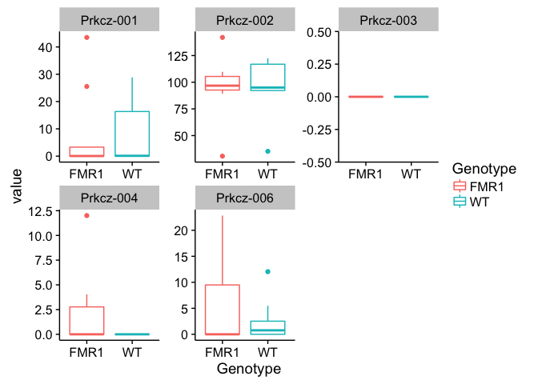

    ## plotting some favorite genes
    favoritegenes <-  full_join(geneids, tpm)

    ## Joining, by = "id"

    favoritegenes <- favoritegenes[-c(1:6,8:12)]  
    favoritegenes <- melt(favoritegenes, id=c("gene"))
    head(favoritegenes)

    ##    gene variable   value
    ## 1  Xkr4  16-116B 48.0911
    ## 2   Rp1  16-116B  0.0000
    ## 3   Rp1  16-116B  0.0000
    ## 4   Rp1  16-116B  0.0000
    ## 5 Sox17  16-116B  0.0000
    ## 6 Sox17  16-116B  0.0000

    favoritegenes <- favoritegenes %>%
      dplyr::filter(grepl("Fmr1|Prkcz", gene)) %>%
      dplyr::filter(!grepl("Fmr1nb", gene))
    favoritegenes <- rename(favoritegenes, c("variable"="RNAseqID"))
    favoritegenes <- join(favoritegenes, Traits, by = "RNAseqID", type = "full", match = "all")

    ggplot(favoritegenes, aes(RNAseqID, value, colour = Genotype)) + 
      geom_point() + 
      facet_wrap(~ gene, scales = "free", ncol=3)

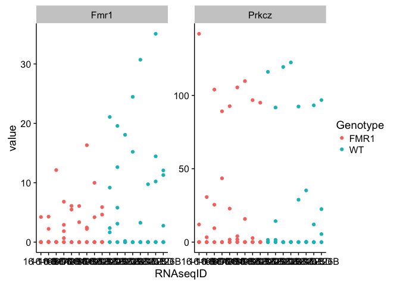

    ggplot(favoritegenes, aes(Genotype, value, colour = Genotype)) + 
      geom_boxplot() + 
      facet_wrap(~ gene, scales = "free", ncol=3)

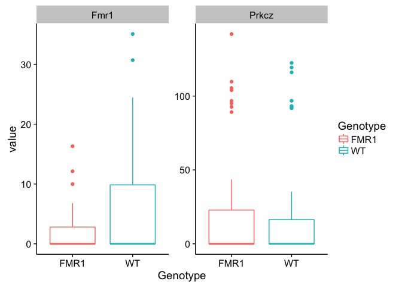

DESeq Analysis
--------------

Now, I'll look for differential gene expression between the FMR1-KO and
WT mice. This analysis was developed by reading the DESEq manual. In
many place, I try to provide the chapter where these steps are described
in more details.

    # 1.3.3 Count matrix input ----
    countData <- countbygene 
    colData <- Traits %>%
      arrange(RNAseqID) # needs to be in same order a countData
    head(countData)

    ##               16-116B 16-116D 16-117D 16-118B 16-118D 16-119B 16-119D
    ## 0610007P14Rik      19       2      19      13      21      25      19
    ## 0610009B22Rik      10       0       8       6      12      10       8
    ## 0610009L18Rik       5       0       0       2      10       2       1
    ## 0610009O20Rik      40       3      35      86      28      62      60
    ## 0610010F05Rik       8       0       9      16      10      10      12
    ## 0610010K14Rik       3       0       1       1       1       3       2
    ##               16-120B 16-120D 16-122B 16-122D 16-123B 16-123D 16-124D
    ## 0610007P14Rik      16      19      28      35       4      22      20
    ## 0610009B22Rik       8       2      25      16       0       9      12
    ## 0610009L18Rik       3       0       8       6       0       5       3
    ## 0610009O20Rik      93      94      69      89       4      62      40
    ## 0610010F05Rik      13      11      14      15       3      12      12
    ## 0610010K14Rik       2       0       2       3       0       1       3
    ##               16-125B 16-125D 16-126B
    ## 0610007P14Rik       2      15      24
    ## 0610009B22Rik       0       5      11
    ## 0610009L18Rik       0       0      18
    ## 0610009O20Rik      13      61      92
    ## 0610010F05Rik       1       9       9
    ## 0610010K14Rik       0       1       4

    head(colData)

    ##     Mouse Genotype   APA Punch atlaslocation RNAseqID
    ## 1 16-116B     FMR1 Yoked   CA1            74  16-116B
    ## 2 16-116D     FMR1 Yoked   CA1            74  16-116D
    ## 3 16-117D     FMR1 Yoked   CA1            74  16-117D
    ## 4 16-118B     FMR1 Yoked   CA1            74  16-118B
    ## 5 16-118D     FMR1 Yoked   CA1            74  16-118D
    ## 6 16-119B     FMR1 Yoked   CA1            NA  16-119B

    ## removing outliers. if the colDatat dataframe has fewer samples than the colData, then this will remove that sample from the analysis

    colData <- colData %>%
      dplyr::filter(!grepl("16-125B|16-116D|16-123B", RNAseqID)) 

    savecols <- as.character(colData$RNAseqID) #select the sample name column that corresponds to row names
    savecols <- as.vector(savecols) # make it a vector
    countData <- countData %>% select(one_of(savecols)) # select just the columns that match the samples in colData

    ## remove genes with total counts across all samples < 2
    countData[countData < 2] <- 0

    ## differential gene expression
    dds <- DESeqDataSetFromMatrix(countData = countData,
                                  colData = colData,
                                  design = ~ Genotype)

    ## converting counts to integer mode

    dds

    ## class: DESeqDataSet 
    ## dim: 22485 14 
    ## metadata(1): version
    ## assays(1): counts
    ## rownames(22485): 0610007P14Rik 0610009B22Rik ... Zzef1 Zzz3
    ## rowData names(0):
    ## colnames(14): 16-116B 16-117D ... 16-125D 16-126B
    ## colData names(6): Mouse Genotype ... atlaslocation RNAseqID

    ## 1.3.6 Pre-filtering
    dds <- dds[ rowSums(counts(dds)) > 1, ]

    ## 1.3.7 Note on factor levels
    dds$Genotype <- factor(dds$Genotype, levels=c("WT","FMR1"))

    ## 1.4  Differential expression analysi
    dds <- DESeq(dds)

    ## estimating size factors

    ## estimating dispersions

    ## gene-wise dispersion estimates

    ## mean-dispersion relationship

    ## final dispersion estimates

    ## fitting model and testing

    ## -- replacing outliers and refitting for 106 genes
    ## -- DESeq argument 'minReplicatesForReplace' = 7 
    ## -- original counts are preserved in counts(dds)

    ## estimating dispersions

    ## fitting model and testing

    # general deseq
    res <- results(dds, independentFiltering = F)
    resOrdered <- res[order(res$padj),]
    summary(res)

    ## 
    ## out of 15946 with nonzero total read count
    ## adjusted p-value < 0.1
    ## LFC > 0 (up)     : 3, 0.019% 
    ## LFC < 0 (down)   : 6, 0.038% 
    ## outliers [1]     : 40, 0.25% 
    ## low counts [2]   : 0, 0% 
    ## (mean count < 0)
    ## [1] see 'cooksCutoff' argument of ?results
    ## [2] see 'independentFiltering' argument of ?results

    head(resOrdered,10)

    ## log2 fold change (MAP): Genotype FMR1 vs WT 
    ## Wald test p-value: Genotype FMR1 vs WT 
    ## DataFrame with 10 rows and 6 columns
    ##             baseMean log2FoldChange      lfcSE      stat       pvalue
    ##            <numeric>      <numeric>  <numeric> <numeric>    <numeric>
    ## Ccnd2       11.70261     -1.1331652 0.14396778 -7.870964 3.519179e-15
    ## Fmr1        15.63877     -0.8246208 0.14496042 -5.688593 1.280906e-08
    ## Serpina3n  133.91021     -0.5146472 0.10985625 -4.684733 2.803248e-06
    ## Cry2       255.05935      0.4265061 0.09267342  4.602248 4.179552e-06
    ## Faim2      885.97410     -0.2096753 0.05105200 -4.107093 4.006703e-05
    ## Nbas        88.81008      0.5056638 0.12203019  4.143760 3.416575e-05
    ## Plat        60.08070     -0.4843732 0.11722179 -4.132109 3.594499e-05
    ## Arel1      126.96366      0.3653896 0.09040251  4.041808 5.304056e-05
    ## Sstr3       30.99935     -0.5813751 0.14425901 -4.030078 5.575835e-05
    ## Ctsb      1093.47092     -0.2720316 0.06848536 -3.972113 7.123788e-05
    ##                   padj
    ##              <numeric>
    ## Ccnd2     5.608164e-11
    ## Fmr1      1.020626e-04
    ## Serpina3n 1.489085e-02
    ## Cry2      1.665134e-02
    ## Faim2     9.121545e-02
    ## Nbas      9.121545e-02
    ## Plat      9.121545e-02
    ## Arel1     9.872945e-02
    ## Sstr3     9.872945e-02
    ## Ctsb      1.135247e-01

    sum(res$padj < 0.1, na.rm = TRUE) 

    ## [1] 9

    res05 <- results(dds, alpha=0.05)
    summary(res05) 

    ## 
    ## out of 15946 with nonzero total read count
    ## adjusted p-value < 0.05
    ## LFC > 0 (up)     : 3, 0.019% 
    ## LFC < 0 (down)   : 4, 0.025% 
    ## outliers [1]     : 40, 0.25% 
    ## low counts [2]   : 9882, 62% 
    ## (mean count < 27)
    ## [1] see 'cooksCutoff' argument of ?results
    ## [2] see 'independentFiltering' argument of ?results

    table(res05$padj < .05)

    ## 
    ## FALSE  TRUE 
    ##  6047     7

    sum(res05$padj < 0.05, na.rm=TRUE)

    ## [1] 7

    ## 1.5 exploring and reporting results

    plotMA(res, main="plotMA")

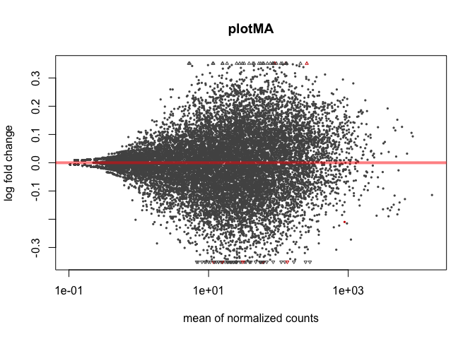

    plotMA(res, ylim=c(-2,2))

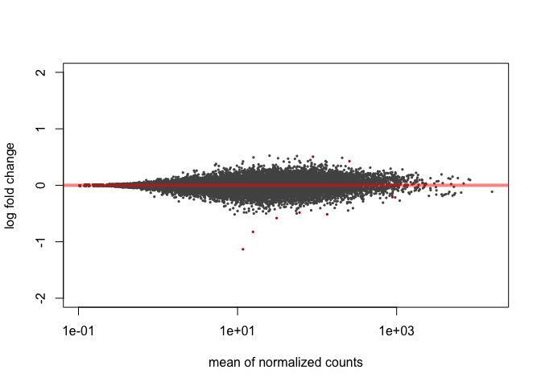

    resMLE <- results(dds)
    head(resMLE, 4)

    ## log2 fold change (MAP): Genotype FMR1 vs WT 
    ## Wald test p-value: Genotype FMR1 vs WT 
    ## DataFrame with 4 rows and 6 columns
    ##                baseMean log2FoldChange      lfcSE       stat    pvalue
    ##               <numeric>      <numeric>  <numeric>  <numeric> <numeric>
    ## 0610007P14Rik 20.817421    -0.05644529 0.14334899 -0.3937613 0.6937573
    ## 0610009B22Rik  9.804451    -0.15095973 0.13780642 -1.0954478 0.2733205
    ## 0610009L18Rik  4.075128    -0.09670628 0.08524975 -1.1343878 0.2566319
    ## 0610009O20Rik 62.718777     0.02493362 0.14190827  0.1757024 0.8605278
    ##                    padj
    ##               <numeric>
    ## 0610007P14Rik        NA
    ## 0610009B22Rik        NA
    ## 0610009L18Rik        NA
    ## 0610009O20Rik        NA

    hist(res$pvalue[res$baseMean > 1], breaks=0:20/20, col="grey50", border="white")

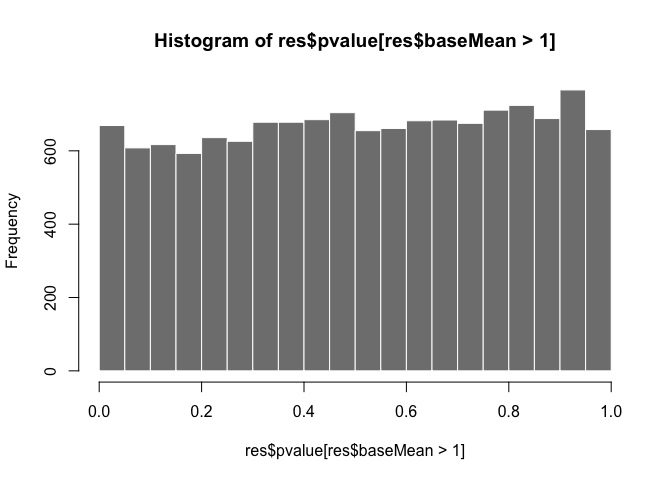

    plotCounts(dds, gene=which.min(res$padj), intgroup="Genotype")

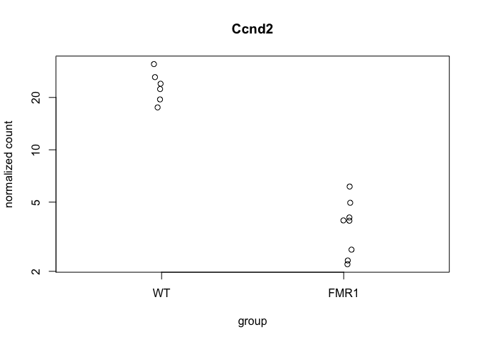

    respadj <- as.data.frame(res$padj)
    head(respadj)

    ##   res$padj
    ## 1        1
    ## 2        1
    ## 3        1
    ## 4        1
    ## 5        1
    ## 6        1

    ## 1.5 more info
    mcols(res)$description

    ## [1] "mean of normalized counts for all samples"  
    ## [2] "log2 fold change (MAP): Genotype FMR1 vs WT"
    ## [3] "standard error: Genotype FMR1 vs WT"        
    ## [4] "Wald statistic: Genotype FMR1 vs WT"        
    ## [5] "Wald test p-value: Genotype FMR1 vs WT"     
    ## [6] "BH adjusted p-values"

    ## for variance stablized gene expression and log transformed data
    rld <- rlog(dds, blind=FALSE)
    vsd <- varianceStabilizingTransformation(dds, blind=FALSE)
    vsd.fast <- vst(dds, blind=FALSE)
    head(assay(rld), 3)

    ##                16-116B  16-117D  16-118B  16-118D  16-119B  16-119D
    ## 0610007P14Rik 4.388770 4.496707 4.218560 4.389949 4.389225 4.323957
    ## 0610009B22Rik 3.302987 3.322726 3.194499 3.318947 3.260185 3.236169
    ## 0610009L18Rik 2.022880 1.933274 1.951776 2.097206 1.954273 1.922460
    ##                16-120B  16-120D  16-122B  16-122D  16-123D  16-124D
    ## 0610007P14Rik 4.259820 4.369440 4.401517 4.429201 4.364918 4.340158
    ## 0610009B22Rik 3.223767 3.151543 3.434447 3.301772 3.251979 3.296768
    ## 0610009L18Rik 1.967072 1.925234 2.037576 1.998624 2.004301 1.972722
    ##                16-125D  16-126B
    ## 0610007P14Rik 4.322586 4.363500
    ## 0610009B22Rik 3.212347 3.267271
    ## 0610009L18Rik 1.926191 2.170728

pca plot
--------

    pcaData <- plotPCA(rld, intgroup = c( "Genotype"), returnData=TRUE)
    pcaData

    ##                PC1           PC2 group Genotype    name
    ## 16-116B -3.7593475  4.1804061507  FMR1     FMR1 16-116B
    ## 16-117D -3.6670308  1.8806923861  FMR1     FMR1 16-117D
    ## 16-118B -2.8899594 -3.8443095652  FMR1     FMR1 16-118B
    ## 16-118D  1.3597479 -1.9486495210  FMR1     FMR1 16-118D
    ## 16-119B  6.1931949 -1.7187824221  FMR1     FMR1 16-119B
    ## 16-119D -3.1422788 -1.5470372649  FMR1     FMR1 16-119D
    ## 16-120B -3.8723042 -2.2999883719  FMR1     FMR1 16-120B
    ## 16-120D -0.9307661  2.4711387106  FMR1     FMR1 16-120D
    ## 16-122B  5.1501238  0.7147899798    WT       WT 16-122B
    ## 16-122D  4.5305677  0.0009912779    WT       WT 16-122D
    ## 16-123D -1.7982088 -3.1868890939    WT       WT 16-123D
    ## 16-124D -2.6105824  2.7234716257    WT       WT 16-124D
    ## 16-125D -1.0969129  0.7596067948    WT       WT 16-125D
    ## 16-126B  6.5337567  1.8145593136    WT       WT 16-126B

    percentVar <- round(100 * attr(pcaData, "percentVar"))

    ggplot(pcaData, aes(PC1, PC2, color=Genotype)) + geom_point(size=3) +
      xlab(paste0("PC1: ",percentVar[1],"% variance")) +
      ylab(paste0("PC2: ",percentVar[2],"% variance")) +
      coord_fixed()

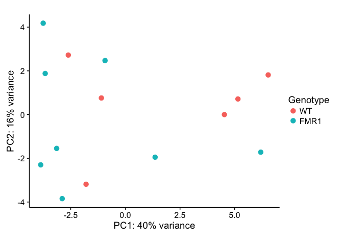

    library("genefilter")
    library("pheatmap")
    topVarGenes <- head(order(rowVars(assay(rld)),decreasing=TRUE),25)
    mat <- assay(rld)[ topVarGenes, ]
    mat <- mat - rowMeans(mat)
    df <- as.data.frame(colData(rld)[,c("Genotype")])
    pheatmap(mat)

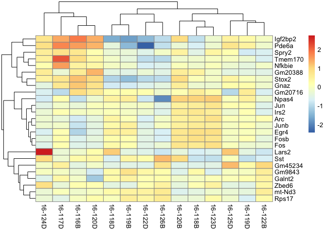

DESeq2 with transcripts, not genes!!!
-------------------------------------

    # 1.3.3 Count matrix input ----
    countData <- count 
    countData <- countData %>% 
      mutate_each(funs(round(.,0)), -id) 
    str(countData)

    ## 'data.frame':    58716 obs. of  18 variables:
    ##  $ id     : chr  "ENSMUST00000070533.4|ENSMUSG00000051951.5|OTTMUSG00000026353.2|OTTMUST00000065166.1|Xkr4-001|Xkr4|3634|UTR5:1-150|CDS:151-2094|"| __truncated__ "ENSMUST00000208660.1|ENSMUSG00000025900.11|OTTMUSG00000049985.3|OTTMUST00000145515.1|Rp1-003|Rp1|4170|UTR5:1-54|CDS:55-4170|" "ENSMUST00000027032.5|ENSMUSG00000025900.11|OTTMUSG00000049985.3|OTTMUST00000127195.2|Rp1-001|Rp1|6869|UTR5:1-127|CDS:128-6415|U"| __truncated__ "ENSMUST00000194992.6|ENSMUSG00000109048.1|-|-|Rp1-201|Rp1|858|CDS:1-858|" ...
    ##  $ 16-116B: num  141 0 0 0 0 0 0 0 0 1 ...
    ##  $ 16-116D: num  0 0 0 0 0 0 0 0 0 0 ...
    ##  $ 16-117D: num  83 0 1 0 0 0 0 4 0 0 ...
    ##  $ 16-118B: num  189 0 0 0 0 0 0 0 0 0 ...
    ##  $ 16-118D: num  141 0 0 0 0 0 0 5 0 0 ...
    ##  $ 16-119B: num  99 0 0 0 0 0 0 2 0 1 ...
    ##  $ 16-119D: num  223 0 0 0 0 0 0 0 0 2 ...
    ##  $ 16-120B: num  152 0 0 0 0 2 0 0 1 0 ...
    ##  $ 16-120D: num  89 0 0 0 0 0 0 0 0 0 ...
    ##  $ 16-122B: num  126 0 0 0 0 0 0 0 0 0 ...
    ##  $ 16-122D: num  178 1 0 0 0 1 0 0 0 1 ...
    ##  $ 16-123B: num  61 0 0 0 0 0 0 0 0 0 ...
    ##  $ 16-123D: num  158 0 0 0 0 0 0 24 0 0 ...
    ##  $ 16-124D: num  144 0 0 0 0 0 0 0 0 1 ...
    ##  $ 16-125B: num  12 0 0 0 0 0 0 0 0 0 ...
    ##  $ 16-125D: num  140 0 0 0 0 0 0 0 0 1 ...
    ##  $ 16-126B: num  105 1 0 0 0 2 0 0 0 1 ...

    colData <- Traits %>%
      arrange(RNAseqID) # needs to be in same order a countData
    head(countData)

    ##                                                                                                                                                    id
    ## 1      ENSMUST00000070533.4|ENSMUSG00000051951.5|OTTMUSG00000026353.2|OTTMUST00000065166.1|Xkr4-001|Xkr4|3634|UTR5:1-150|CDS:151-2094|UTR3:2095-3634|
    ## 2                        ENSMUST00000208660.1|ENSMUSG00000025900.11|OTTMUSG00000049985.3|OTTMUST00000145515.1|Rp1-003|Rp1|4170|UTR5:1-54|CDS:55-4170|
    ## 3       ENSMUST00000027032.5|ENSMUSG00000025900.11|OTTMUSG00000049985.3|OTTMUST00000127195.2|Rp1-001|Rp1|6869|UTR5:1-127|CDS:128-6415|UTR3:6416-6869|
    ## 4                                                                            ENSMUST00000194992.6|ENSMUSG00000109048.1|-|-|Rp1-201|Rp1|858|CDS:1-858|
    ## 5 ENSMUST00000027035.9|ENSMUSG00000025902.13|OTTMUSG00000050014.7|OTTMUST00000127245.2|Sox17-001|Sox17|3127|UTR5:1-1082|CDS:1083-2342|UTR3:2343-3127|
    ## 6   ENSMUST00000195555.1|ENSMUSG00000025902.13|OTTMUSG00000050014.7|OTTMUST00000127249.1|Sox17-005|Sox17|1977|UTR5:1-635|CDS:636-1511|UTR3:1512-1977|
    ##   16-116B 16-116D 16-117D 16-118B 16-118D 16-119B 16-119D 16-120B 16-120D
    ## 1     141       0      83     189     141      99     223     152      89
    ## 2       0       0       0       0       0       0       0       0       0
    ## 3       0       0       1       0       0       0       0       0       0
    ## 4       0       0       0       0       0       0       0       0       0
    ## 5       0       0       0       0       0       0       0       0       0
    ## 6       0       0       0       0       0       0       0       2       0
    ##   16-122B 16-122D 16-123B 16-123D 16-124D 16-125B 16-125D 16-126B
    ## 1     126     178      61     158     144      12     140     105
    ## 2       0       1       0       0       0       0       0       1
    ## 3       0       0       0       0       0       0       0       0
    ## 4       0       0       0       0       0       0       0       0
    ## 5       0       0       0       0       0       0       0       0
    ## 6       0       1       0       0       0       0       0       2

    head(colData)

    ##     Mouse Genotype   APA Punch atlaslocation RNAseqID
    ## 1 16-116B     FMR1 Yoked   CA1            74  16-116B
    ## 2 16-116D     FMR1 Yoked   CA1            74  16-116D
    ## 3 16-117D     FMR1 Yoked   CA1            74  16-117D
    ## 4 16-118B     FMR1 Yoked   CA1            74  16-118B
    ## 5 16-118D     FMR1 Yoked   CA1            74  16-118D
    ## 6 16-119B     FMR1 Yoked   CA1            NA  16-119B

    ## removing outliers. if the colDatat dataframe has fewer samples than the colData, then this will remove that sample from the analysis

    colData <- colData %>%
      dplyr::filter(!grepl("16-125B|16-116D|16-123B", RNAseqID)) 

    savecols <- as.character(colData$RNAseqID) #select the sample name column that corresponds to row names
    savecols <- as.vector(savecols) # make it a vector
    countData <- countData %>% select(one_of(savecols)) # select just the columns that match the samples in colData

    ## remove genes with total counts across all samples < 2
    countData[countData < 2] <- 0

    ## differential gene expression
    dds <- DESeqDataSetFromMatrix(countData = countData,
                                  colData = colData,
                                  design = ~ Genotype)

    ## converting counts to integer mode

    dds

    ## class: DESeqDataSet 
    ## dim: 58716 14 
    ## metadata(1): version
    ## assays(1): counts
    ## rownames: NULL
    ## rowData names(0):
    ## colnames(14): 16-116B 16-117D ... 16-125D 16-126B
    ## colData names(6): Mouse Genotype ... atlaslocation RNAseqID

    ## 1.3.6 Pre-filtering
    dds <- dds[ rowSums(counts(dds)) > 1, ]

    ## 1.3.7 Note on factor levels
    dds$Genotype <- factor(dds$Genotype, levels=c("WT","FMR1"))

    ## 1.4  Differential expression analysi
    dds <- DESeq(dds)

    ## estimating size factors

    ## estimating dispersions

    ## gene-wise dispersion estimates

    ## mean-dispersion relationship

    ## final dispersion estimates

    ## fitting model and testing

    ## -- replacing outliers and refitting for 3443 genes
    ## -- DESeq argument 'minReplicatesForReplace' = 7 
    ## -- original counts are preserved in counts(dds)

    ## estimating dispersions

    ## fitting model and testing

    # general deseq
    res <- results(dds, independentFiltering = F)
    resOrdered <- res[order(res$padj),]
    summary(res)

    ## 
    ## out of 41443 with nonzero total read count
    ## adjusted p-value < 0.1
    ## LFC > 0 (up)     : 1, 0.0024% 
    ## LFC < 0 (down)   : 1, 0.0024% 
    ## outliers [1]     : 1344, 3.2% 
    ## low counts [2]   : 0, 0% 
    ## (mean count < 0)
    ## [1] see 'cooksCutoff' argument of ?results
    ## [2] see 'independentFiltering' argument of ?results

    head(resOrdered,10)

    ## log2 fold change (MAP): Genotype FMR1 vs WT 
    ## Wald test p-value: Genotype FMR1 vs WT 
    ## DataFrame with 10 rows and 6 columns
    ##        baseMean log2FoldChange      lfcSE         stat       pvalue
    ##       <numeric>      <numeric>  <numeric>    <numeric>    <numeric>
    ## 1    44.1426802  -2.2240322237 0.23209051 -9.582607199 9.462553e-22
    ## 2   747.6428949   0.3202725840 0.06726422  4.761410920 1.922442e-06
    ## 3   481.0237527   0.4314312887 0.09918084  4.349945828 1.361712e-05
    ## 4   132.3040310  -0.5759092683 0.14341073 -4.015803138 5.924369e-05
    ## 5   161.7544118   0.5722516124 0.15059684  3.799891148 1.447597e-04
    ## 6  1175.2300061   0.4131410464 0.10855128  3.805952890 1.412593e-04
    ## 7   129.8153167   0.9298029353 0.24747603  3.757143399 1.718640e-04
    ## 8  1080.2052913  -0.2841769272 0.07586209 -3.745967363 1.797000e-04
    ## 9   136.1482635   0.1348554861 0.18652522  0.722987938 4.696873e-01
    ## 10    0.2418434  -0.0007902229 0.09640590 -0.008196831 9.934599e-01
    ##            padj
    ##       <numeric>
    ## 1  3.868197e-17
    ## 2  3.929374e-02
    ## 3  1.855514e-01
    ## 4  6.054557e-01
    ## 5  9.182443e-01
    ## 6  9.182443e-01
    ## 7  9.182443e-01
    ## 8  9.182443e-01
    ## 9  1.000000e+00
    ## 10 1.000000e+00

    sum(res$padj < 0.1, na.rm = TRUE) 

    ## [1] 2

    res05 <- results(dds, alpha=0.05)
    summary(res05) 

    ## 
    ## out of 41443 with nonzero total read count
    ## adjusted p-value < 0.05
    ## LFC > 0 (up)     : 1, 0.0024% 
    ## LFC < 0 (down)   : 1, 0.0024% 
    ## outliers [1]     : 1344, 3.2% 
    ## low counts [2]   : 780, 1.9% 
    ## (mean count < 0)
    ## [1] see 'cooksCutoff' argument of ?results
    ## [2] see 'independentFiltering' argument of ?results

    table(res05$padj < .05)

    ## 
    ## FALSE  TRUE 
    ## 40097     2

    sum(res05$padj < 0.05, na.rm=TRUE)

    ## [1] 2

    ## 1.5 exploring and reporting results

    plotMA(res, main="plotMA")

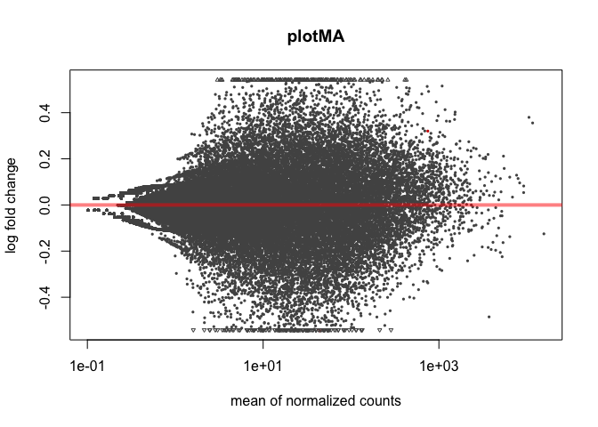

    plotMA(res, ylim=c(-2,2))

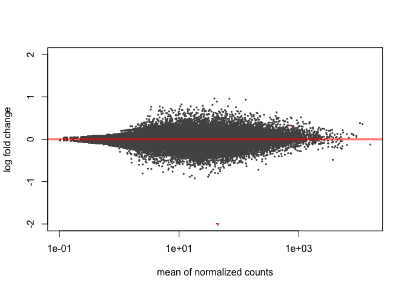

    resMLE <- results(dds)
    head(resMLE, 4)

    ## log2 fold change (MAP): Genotype FMR1 vs WT 
    ## Wald test p-value: Genotype FMR1 vs WT 
    ## DataFrame with 4 rows and 6 columns
    ##      baseMean log2FoldChange     lfcSE         stat    pvalue      padj
    ##     <numeric>      <numeric> <numeric>    <numeric> <numeric> <numeric>
    ## 1 136.1482635   0.1348554861 0.1865252  0.722987938 0.4696873 0.9999377
    ## 2   0.2418434  -0.0007902229 0.0964059 -0.008196831 0.9934599 0.9999377
    ## 3   2.6042291  -0.0449827665 0.1090677 -0.412429870        NA        NA
    ## 4   0.1326960   0.0289612752 0.0964059  0.300409777 0.7638646 0.9999377

    hist(res$pvalue[res$baseMean > 1], breaks=0:20/20, col="grey50", border="white")

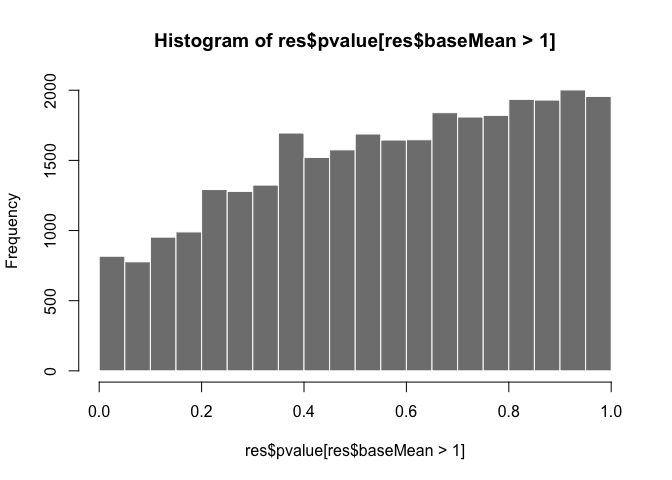

    plotCounts(dds, gene=which.min(res$padj), intgroup="Genotype")

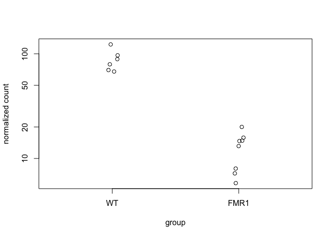

    respadj <- as.data.frame(res$padj)
    head(respadj)

    ##   res$padj
    ## 1        1
    ## 2        1
    ## 3       NA
    ## 4        1
    ## 5        1
    ## 6        1

    ## 1.5 more info
    mcols(res)$description

    ## [1] "mean of normalized counts for all samples"  
    ## [2] "log2 fold change (MAP): Genotype FMR1 vs WT"
    ## [3] "standard error: Genotype FMR1 vs WT"        
    ## [4] "Wald statistic: Genotype FMR1 vs WT"        
    ## [5] "Wald test p-value: Genotype FMR1 vs WT"     
    ## [6] "BH adjusted p-values"

    ## for variance stablized gene expression and log transformed data
    rld <- rlog(dds, blind=FALSE)
    vsd <- varianceStabilizingTransformation(dds, blind=FALSE)
    vsd.fast <- vst(dds, blind=FALSE)

    ## -- note: fitType='parametric', but the dispersion trend was not well captured by the
    ##    function: y = a/x + b, and a local regression fit was automatically substituted.
    ##    specify fitType='local' or 'mean' to avoid this message next time.

    head(assay(rld), 3)

    ##        16-116B   16-117D   16-118B   16-118D   16-119B   16-119D   16-120B
    ## [1,]  7.272327  7.111106  7.223762  7.178481  6.666206  7.490797  7.017906
    ## [2,] -1.654845 -1.652867 -1.656706 -1.655366 -1.656403 -1.656147 -1.634985
    ## [3,]  1.060522  1.222052  1.059497  1.192804  1.106480  1.059772  1.059510
    ##        16-120D   16-122B   16-122D   16-123D   16-124D   16-125D   16-126B
    ## [1,]  6.766955  6.831857  7.014411  7.159233  7.065360  7.252676  6.682056
    ## [2,] -1.655232 -1.656729 -1.657553 -1.656092 -1.656116 -1.654915 -1.634933
    ## [3,]  1.060282  1.059486  1.059125  1.512567  1.059789  1.060477  1.059535

    pcaData <- plotPCA(rld, intgroup = c( "Genotype"), returnData=TRUE)
    pcaData

    ##                 PC1        PC2 group Genotype    name
    ## 16-116B -29.1489928   8.263538  FMR1     FMR1 16-116B
    ## 16-117D  -7.0913017 -18.579821  FMR1     FMR1 16-117D
    ## 16-118B   1.4481099  -5.849164  FMR1     FMR1 16-118B
    ## 16-118D   3.9137187   3.458847  FMR1     FMR1 16-118D
    ## 16-119B   1.5757765   6.059143  FMR1     FMR1 16-119B
    ## 16-119D   5.1915889  -8.383541  FMR1     FMR1 16-119D
    ## 16-120B   1.2448445  -8.833126  FMR1     FMR1 16-120B
    ## 16-120D   7.1287580  12.374182  FMR1     FMR1 16-120D
    ## 16-122B   2.0181603   6.682327    WT       WT 16-122B
    ## 16-122D   6.4150523   5.411242    WT       WT 16-122D
    ## 16-123D  -0.9742826  -1.658842    WT       WT 16-123D
    ## 16-124D   3.6198111  -3.963376    WT       WT 16-124D
    ## 16-125D  -0.1563977  -0.236770    WT       WT 16-125D
    ## 16-126B   4.8151546   5.255361    WT       WT 16-126B

    percentVar <- round(100 * attr(pcaData, "percentVar"))

    ggplot(pcaData, aes(PC1, PC2, color=Genotype)) + geom_point(size=3) +
      xlab(paste0("PC1: ",percentVar[1],"% variance")) +
      ylab(paste0("PC2: ",percentVar[2],"% variance")) +
      coord_fixed()

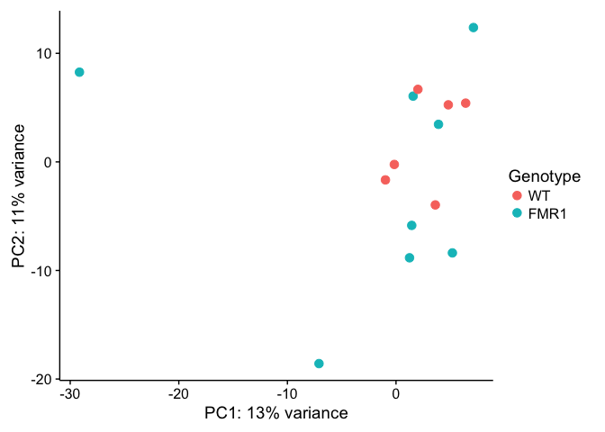

    library("genefilter")
    library("pheatmap")
    topVarGenes <- head(order(rowVars(assay(rld)),decreasing=TRUE),25)
    mat <- assay(rld)[ topVarGenes, ]
    mat <- mat - rowMeans(mat)
    df <- as.data.frame(colData(rld)[,c("Genotype")])
    pheatmap(mat)

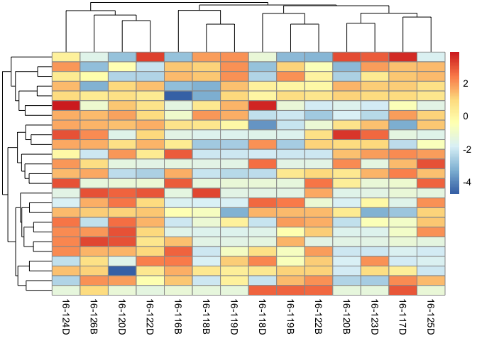

Session Info
------------

    sessionInfo()

    ## R version 3.3.1 (2016-06-21)
    ## Platform: x86_64-apple-darwin13.4.0 (64-bit)
    ## Running under: OS X 10.10.5 (Yosemite)
    ## 
    ## locale:
    ## [1] en_US.UTF-8/en_US.UTF-8/en_US.UTF-8/C/en_US.UTF-8/en_US.UTF-8
    ## 
    ## attached base packages:
    ## [1] parallel  stats4    stats     graphics  grDevices utils     datasets 
    ## [8] methods   base     
    ## 
    ## other attached packages:
    ##  [1] pheatmap_1.0.8             genefilter_1.56.0         
    ##  [3] DESeq2_1.14.0              SummarizedExperiment_1.4.0
    ##  [5] Biobase_2.34.0             GenomicRanges_1.26.1      
    ##  [7] GenomeInfoDb_1.10.1        IRanges_2.8.0             
    ##  [9] S4Vectors_0.12.0           BiocGenerics_0.20.0       
    ## [11] cowplot_0.7.0              gplots_3.0.1              
    ## [13] magrittr_1.5               ggplot2_2.1.0             
    ## [15] reshape2_1.4.2             plyr_1.8.4                
    ## [17] dplyr_0.5.0                tidyr_0.6.0               
    ## 
    ## loaded via a namespace (and not attached):
    ##  [1] locfit_1.5-9.1       Rcpp_0.12.7          lattice_0.20-34     
    ##  [4] gtools_3.5.0         assertthat_0.1       rprojroot_1.2       
    ##  [7] digest_0.6.11        R6_2.2.0             chron_2.3-47        
    ## [10] backports_1.0.5      acepack_1.4.1        RSQLite_1.0.0       
    ## [13] evaluate_0.10        zlibbioc_1.20.0      lazyeval_0.2.0      
    ## [16] data.table_1.9.6     annotate_1.52.0      gdata_2.17.0        
    ## [19] rpart_4.1-10         Matrix_1.2-7.1       rmarkdown_1.3       
    ## [22] labeling_0.3         splines_3.3.1        BiocParallel_1.8.1  
    ## [25] geneplotter_1.52.0   stringr_1.1.0        foreign_0.8-67      
    ## [28] RCurl_1.95-4.8       munsell_0.4.3        htmltools_0.3.5     
    ## [31] nnet_7.3-12          tibble_1.2           gridExtra_2.2.1     
    ## [34] htmlTable_1.7        Hmisc_4.0-0          XML_3.98-1.4        
    ## [37] bitops_1.0-6         grid_3.3.1           xtable_1.8-2        
    ## [40] gtable_0.2.0         DBI_0.5-1            scales_0.4.0        
    ## [43] KernSmooth_2.23-15   stringi_1.1.2        XVector_0.14.0      
    ## [46] latticeExtra_0.6-28  Formula_1.2-1        RColorBrewer_1.1-2  
    ## [49] tools_3.3.1          survival_2.40-1      yaml_2.1.14         
    ## [52] AnnotationDbi_1.36.0 colorspace_1.2-7     cluster_2.0.5       
    ## [55] caTools_1.17.1       knitr_1.15.1
