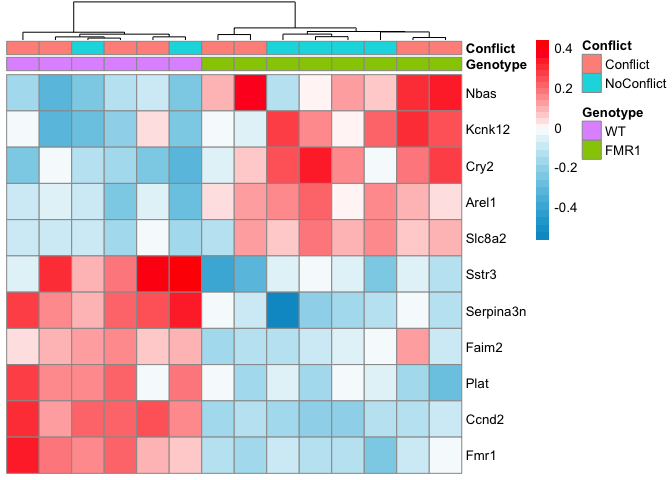
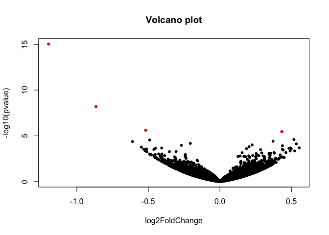

Loading the data
----------------

In the summer of 2016, I processed a bunch of hippocampal tissue samples
from WT and FMR1-KO mice that were trained in an active place avoidance
task.

This data was added the the epically large sample collection database
contained in the two files "animals.csv" and "punches.csv" which
provided a detailed account of all animals processed and all tissue
samples collected. Then, I tidy the dataframe a little bit to get it
prepared for RNAseq sample submision.

    #install.packages("tidyr", dependencies=TRUE)
    #source("https://bioconductor.org/biocLite.R")
    #biocLite("DESeq2")
    library("tidyr") 
    library("dplyr") ## for filtering and selecting rows
    library("plyr")  ## for renmaing factors
    library("reshape2") ##  for melting dataframe
    library("ggplot2") ## for awesome plots!
    library("magrittr") ## to use the weird pipe
    library("gplots") ##for making awesome plots
    library("cowplot") ## for some easy to use themes
    library("DESeq2") ## for differnetial gene expression profiling

    # set output file for figures 
    knitr::opts_chunk$set(fig.path = '../results/fmr1/')

Read the data

DESeq Analysis
--------------

Now, I'll look for differential gene expression between the FMR1-KO and
WT mice. This analysis was developed by reading the DESEq manual. In
many place, I try to provide the chapter where these steps are described
in more details.

    ## estimating size factors

    ## estimating dispersions

    ## gene-wise dispersion estimates

    ## mean-dispersion relationship

    ## final dispersion estimates

    ## fitting model and testing

    ## -- replacing outliers and refitting for 80 genes
    ## -- DESeq argument 'minReplicatesForReplace' = 7 
    ## -- original counts are preserved in counts(dds)

    ## estimating dispersions

    ## fitting model and testing

    ## 
    ## out of 16380 with nonzero total read count
    ## adjusted p-value < 0.1
    ## LFC > 0 (up)     : 3, 0.018% 
    ## LFC < 0 (down)   : 5, 0.031% 
    ## outliers [1]     : 28, 0.17% 
    ## low counts [2]   : 0, 0% 
    ## (mean count < 0)
    ## [1] see 'cooksCutoff' argument of ?results
    ## [2] see 'independentFiltering' argument of ?results

    ## log2 fold change (MAP): Genotype FMR1 vs WT 
    ## Wald test p-value: Genotype FMR1 vs WT 
    ## DataFrame with 10 rows and 6 columns
    ##            baseMean log2FoldChange      lfcSE      stat       pvalue
    ##           <numeric>      <numeric>  <numeric> <numeric>    <numeric>
    ## Ccnd2      11.66235     -1.1975723 0.14904374 -8.035039 9.354902e-16
    ## Fmr1       15.58919     -0.8661023 0.14931025 -5.800689 6.604318e-09
    ## Serpina3n 133.52220     -0.5191172 0.11018764 -4.711211 2.462497e-06
    ## Cry2      254.44599      0.4323550 0.09332056  4.633009 3.603892e-06
    ## Nbas       88.60162      0.5175007 0.12293482  4.209554 2.558758e-05
    ## Plat       59.90495     -0.4908623 0.11734811 -4.182959 2.877398e-05
    ## Arel1     126.65032      0.3714523 0.09034269  4.111592 3.929398e-05
    ## Sstr3      30.90215     -0.6107696 0.14920745 -4.093425 4.250469e-05
    ## Faim2     883.56201     -0.2065500 0.05182845 -3.985263 6.740555e-05
    ## Kcnk12     55.66709      0.5341542 0.13491043  3.959325 7.516190e-05
    ##                   padj
    ##              <numeric>
    ## Ccnd2     1.531210e-11
    ## Fmr1      5.404974e-05
    ## Serpina3n 1.343538e-02
    ## Cry2      1.474713e-02
    ## Nbas      7.849541e-02
    ## Plat      7.849541e-02
    ## Arel1     8.696460e-02
    ## Sstr3     8.696460e-02
    ## Faim2     1.225882e-01
    ## Kcnk12    1.230250e-01

    ##                16-116B  16-117D  16-118B  16-118D  16-119B  16-119D
    ## 0610007P14Rik 4.388280 4.513514 4.184672 4.389387 4.389488 4.312060
    ## 0610009B22Rik 3.302984 3.326054 3.170059 3.322201 3.251287 3.221896
    ## 0610009L18Rik 2.044863 1.935253 1.956248 2.135956 1.959529 1.940810
    ##                16-120B  16-120D  16-122B  16-122D  16-123D  16-124D
    ## 0610007P14Rik 4.234390 4.365729 4.403172 4.435806 4.359560 4.330584
    ## 0610009B22Rik 3.206200 3.117724 3.461597 3.301693 3.240686 3.295584
    ## 0610009L18Rik 1.975462 1.923624 2.063331 2.014827 2.021874 1.982635
    ##                16-125D  16-126B
    ## 0610007P14Rik 4.309708 4.357363
    ## 0610009B22Rik 3.192598 3.259101
    ## 0610009L18Rik 1.924992 2.225786

Data viz
--------

pca plot
--------

    pcaData <- plotPCA(rld, intgroup = c( "Genotype", "Conflict"), returnData=TRUE)
    pcaData

    ##               PC1         PC2             group Genotype   Conflict
    ## 16-116B -3.888337  4.48353839 FMR1 : NoConflict     FMR1 NoConflict
    ## 16-117D -3.808958  2.07726422   FMR1 : Conflict     FMR1   Conflict
    ## 16-118B -3.033380 -3.97051064 FMR1 : NoConflict     FMR1 NoConflict
    ## 16-118D  1.465589 -2.10830797   FMR1 : Conflict     FMR1   Conflict
    ## 16-119B  6.248326 -1.76716206 FMR1 : NoConflict     FMR1 NoConflict
    ## 16-119D -3.222917 -1.70704169   FMR1 : Conflict     FMR1   Conflict
    ## 16-120B -3.867287 -2.33568853 FMR1 : NoConflict     FMR1 NoConflict
    ## 16-120D -1.027550  2.44706581   FMR1 : Conflict     FMR1   Conflict
    ## 16-122B  5.328264  0.72280554   WT : NoConflict       WT NoConflict
    ## 16-122D  4.614738  0.06105386     WT : Conflict       WT   Conflict
    ## 16-123D -1.958825 -3.37363467     WT : Conflict       WT   Conflict
    ## 16-124D -2.591858  2.84251258     WT : Conflict       WT   Conflict
    ## 16-125D -0.936705  0.72396712     WT : Conflict       WT   Conflict
    ## 16-126B  6.678900  1.90413803   WT : NoConflict       WT NoConflict
    ##            name
    ## 16-116B 16-116B
    ## 16-117D 16-117D
    ## 16-118B 16-118B
    ## 16-118D 16-118D
    ## 16-119B 16-119B
    ## 16-119D 16-119D
    ## 16-120B 16-120B
    ## 16-120D 16-120D
    ## 16-122B 16-122B
    ## 16-122D 16-122D
    ## 16-123D 16-123D
    ## 16-124D 16-124D
    ## 16-125D 16-125D
    ## 16-126B 16-126B

    percentVar <- round(100 * attr(pcaData, "percentVar"))

    ggplot(pcaData, aes(PC1, PC2, color=Genotype, label = name)) + geom_point(size=3) +
      xlab(paste0("PC1: ",percentVar[1],"% variance")) +
      ylab(paste0("PC2: ",percentVar[2],"% variance")) +
      geom_text() +
      coord_fixed()

    library("genefilter")
    library("pheatmap")
    topVarGenes <- head(order(rowVars(assay(rld)),decreasing=TRUE),25)
    mat <- assay(rld)[ topVarGenes, ]
    mat <- mat - rowMeans(mat)
    df <- as.data.frame(colData(rld)[,c("Genotype")])
    pheatmap(mat)

    ## differntiall expressed heatmap
    source("resvalsfunction.R")
    DEGes <- assay(rld)
    contrast1 <- resvals(contrastvector = c("Genotype", "FMR1", "WT"), mypadj = 0.1)

    ## [1] 8

    DEGes <- cbind(DEGes, contrast1)
    DEGes <- as.data.frame(DEGes) # convert matrix to dataframe
    DEGes$rownames <- rownames(DEGes)  # add the rownames to the dataframe
    DEGes$pvaljmin <- with(DEGes, pmin(pvalGenotypeFMR1WT)) # create new col with min pval
    DEGes <- DEGes %>% filter(pvaljmin < 0.0001)
    rownames(DEGes) <- DEGes$rownames
    drop.cols <-colnames(DEGes[,grep("padj|pval|rownames", colnames(DEGes))])
    DEGes <- DEGes %>% dplyr::select(-one_of(drop.cols))
    DEGes <- as.matrix(DEGes)
    DEGes <- DEGes - rowMeans(DEGes)
    head(DEGes)

    ##             16-116B     16-117D    16-118B     16-118D      16-119B
    ## Arel1   0.163176523  0.08195309  0.2100104  0.04227007  0.008253932
    ## Ccnd2  -0.141955224 -0.12812897 -0.1999729 -0.17686706 -0.194054091
    ## Cry2   -0.014136755  0.17321617  0.3371802 -0.07559586  0.166244568
    ## Faim2  -0.003135448  0.10763085 -0.1079995 -0.15378407 -0.073451944
    ## Fmr1   -0.236092987 -0.10155784 -0.1429344 -0.13628943 -0.149186946
    ## Kcnk12  0.213711133  0.28934734  0.1431860 -0.01032818  0.004947916
    ##            16-119D    16-120B     16-120D     16-122B    16-122D
    ## Arel1   0.04336689  0.1578817  0.12429450 -0.09577767 -0.2409772
    ## Ccnd2  -0.10661091 -0.1596643 -0.12651317  0.22076803  0.1987041
    ## Cry2    0.27737065  0.2452212  0.04526756 -0.14969466 -0.1623408
    ## Faim2  -0.08909158 -0.1251541 -0.13934828  0.13475049  0.1631355
    ## Fmr1   -0.03190648 -0.1071710 -0.15242478  0.15772913  0.2127494
    ## Kcnk12  0.23960606  0.2601163 -0.06843478 -0.27882525 -0.2192953
    ##            16-123D     16-124D     16-125D     16-126B
    ## Arel1  -0.06628602 -0.07457958 -0.07983211 -0.27375455
    ## Ccnd2   0.11041278  0.24963281  0.30868546  0.14556338
    ## Cry2   -0.01666378 -0.24636005 -0.25748767 -0.32222076
    ## Faim2   0.09678859  0.05098114  0.04447851  0.09419984
    ## Fmr1    0.17277205  0.10098414  0.34375606  0.06957313
    ## Kcnk12 -0.30988144  0.02475998 -0.02395756 -0.26495223

    ## set anntation variables
    df <- as.data.frame(colData(dds)[,c("Genotype","Conflict")]) ## matrix to df

    # set color breaks
    paletteLength <- 30
    myBreaks <- c(seq(min(DEGes), 0, length.out=ceiling(paletteLength/2) + 1), 
                  seq(max(DEGes)/paletteLength, max(DEGes), length.out=floor(paletteLength/2)))

    colorpalette <-  colorRampPalette(c("Deep Sky Blue 3", "white", "red"))( 30 )

    pheatmap(DEGes, show_colnames=F, show_rownames = T,
             annotation_col=df, 
             #annotation_colors = ann_colors,
             treeheight_row = 0, treeheight_col = 25,
             #fontsize = 11, 
             #width=4.5, height=3,
             border_color = "grey60" ,
             color = colorpalette,
             #cellwidth = 12, 
             clustering_method="average",
             breaks=myBreaks,
             clustering_distance_cols="correlation" 
             )

Volcano plot
------------

    with(res, plot(log2FoldChange, -log10(pvalue), pch=20, main="Volcano plot"))
    with(subset(res, padj<.1 ), points(log2FoldChange, -log10(pvalue), pch=20, col="orange"))
    with(subset(res, padj<.01 ), points(log2FoldChange, -log10(pvalue), pch=20, col="red"))

    #with(subset(res, abs(log2FoldChange)>1), points(log2FoldChange, -log10(pvalue), pch=20, col="orange"))
    #with(subset(res, padj<.05 & abs(log2FoldChange)>1), points(log2FoldChange, -log10(pvalue), pch=20, col="green"))

Session Info
------------

    sessionInfo()

    ## R version 3.3.1 (2016-06-21)
    ## Platform: x86_64-apple-darwin13.4.0 (64-bit)
    ## Running under: OS X 10.10.5 (Yosemite)
    ## 
    ## locale:
    ## [1] en_US.UTF-8/en_US.UTF-8/en_US.UTF-8/C/en_US.UTF-8/en_US.UTF-8
    ## 
    ## attached base packages:
    ## [1] parallel  stats4    stats     graphics  grDevices utils     datasets 
    ## [8] methods   base     
    ## 
    ## other attached packages:
    ##  [1] pheatmap_1.0.8             genefilter_1.56.0         
    ##  [3] DESeq2_1.14.1              SummarizedExperiment_1.4.0
    ##  [5] Biobase_2.34.0             GenomicRanges_1.26.3      
    ##  [7] GenomeInfoDb_1.10.3        IRanges_2.8.1             
    ##  [9] S4Vectors_0.12.1           BiocGenerics_0.20.0       
    ## [11] cowplot_0.7.0              gplots_3.0.1              
    ## [13] magrittr_1.5               ggplot2_2.2.1             
    ## [15] reshape2_1.4.2             plyr_1.8.4                
    ## [17] dplyr_0.5.0                tidyr_0.6.1               
    ## 
    ## loaded via a namespace (and not attached):
    ##  [1] splines_3.3.1        gtools_3.5.0         Formula_1.2-1       
    ##  [4] assertthat_0.1       latticeExtra_0.6-28  yaml_2.1.14         
    ##  [7] RSQLite_1.1-2        backports_1.0.5      lattice_0.20-34     
    ## [10] digest_0.6.12        RColorBrewer_1.1-2   XVector_0.14.0      
    ## [13] checkmate_1.8.2      colorspace_1.3-2     htmltools_0.3.5     
    ## [16] Matrix_1.2-8         XML_3.98-1.5         zlibbioc_1.20.0     
    ## [19] xtable_1.8-2         scales_0.4.1         gdata_2.17.0        
    ## [22] BiocParallel_1.8.1   htmlTable_1.9        tibble_1.2          
    ## [25] annotate_1.52.1      nnet_7.3-12          lazyeval_0.2.0      
    ## [28] survival_2.40-1      memoise_1.0.0        evaluate_0.10       
    ## [31] foreign_0.8-67       tools_3.3.1          data.table_1.10.0   
    ## [34] stringr_1.2.0        munsell_0.4.3        locfit_1.5-9.1      
    ## [37] cluster_2.0.5        AnnotationDbi_1.36.2 caTools_1.17.1      
    ## [40] grid_3.3.1           RCurl_1.95-4.8       htmlwidgets_0.8     
    ## [43] bitops_1.0-6         base64enc_0.1-3      labeling_0.3        
    ## [46] rmarkdown_1.3        gtable_0.2.0         DBI_0.6             
    ## [49] R6_2.2.0             gridExtra_2.2.1      knitr_1.15.1        
    ## [52] Hmisc_4.0-2          rprojroot_1.2        KernSmooth_2.23-15  
    ## [55] stringi_1.1.2        Rcpp_0.12.9          geneplotter_1.52.0  
    ## [58] rpart_4.1-10         acepack_1.4.1
