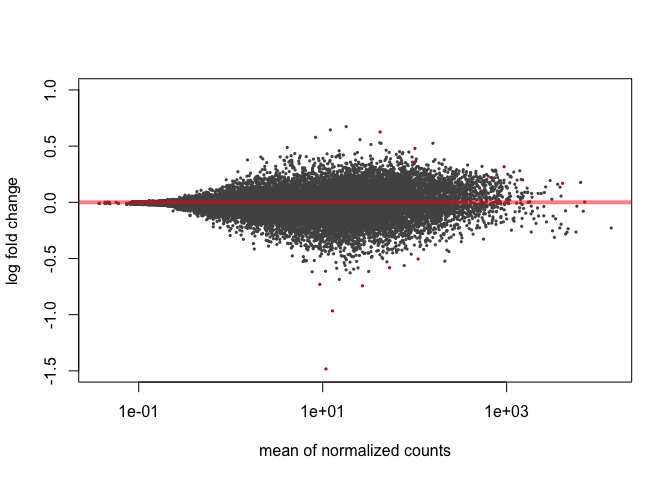
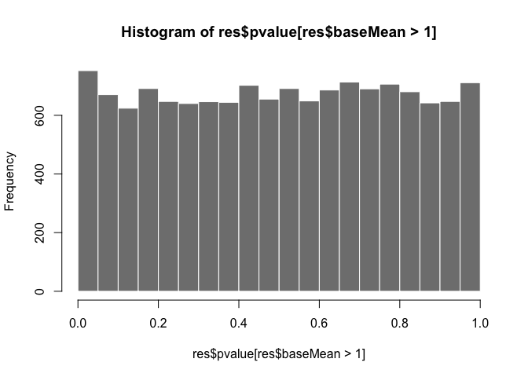
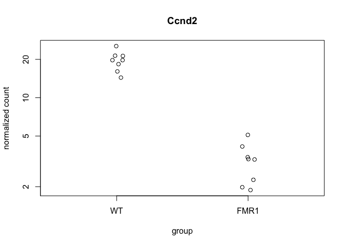
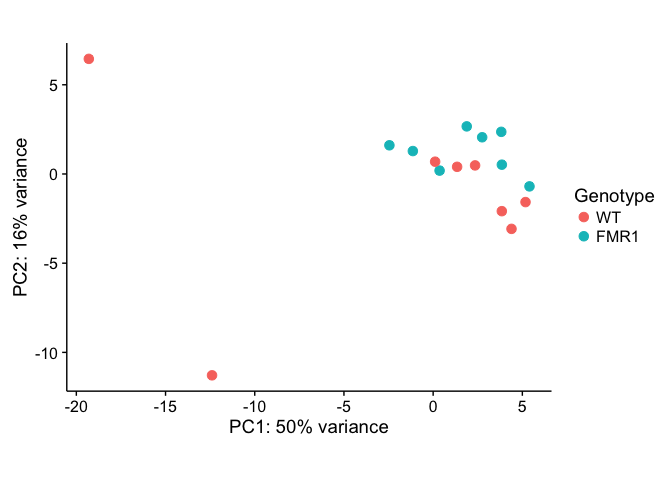
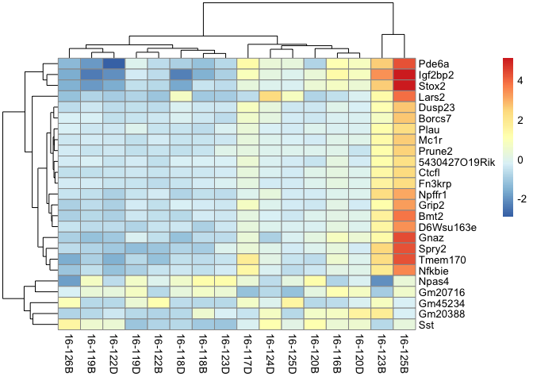

Loading the data
----------------

In the summer of 2016, I processed a bunch of hippocampal tissue samples
from WT and FMR1-KO mice that were trained in an active place avoidance
task.

This data was added the the epically large sample collection database
contained in the two files "animals.csv" and "punches.csv" which
provided a detailed account of all animals processed and all tissue
samples collected. Then, I tidy the dataframe a little bit to get it
prepared for RNAseq sample submision.

    #install.packages("tidyr", dependencies=TRUE)
    #source("https://bioconductor.org/biocLite.R")
    #biocLite("DESeq2")
    library("tidyr") 
    library("dplyr") ## for filtering and selecting rows
    library("plyr")  ## for renmaing factors
    library("reshape2") ##  for melting dataframe
    library("ggplot2") ## for awesome plots!
    library("magrittr") ## to use the weird pipe
    library("gplots") ##for making awesome plots
    library("cowplot") ## for some easy to use themes
    library("DESeq2") ## for differnetial gene expression profiling

    # set output file for figures 
    knitr::opts_chunk$set(fig.path = '../results/fmr1/')

Read the data

DESeq Analysis
--------------

Now, I'll look for differential gene expression between the FMR1-KO and
WT mice. This analysis was developed by reading the DESEq manual. In
many place, I try to provide the chapter where these steps are described
in more details.

    ## estimating size factors

    ## estimating dispersions

    ## gene-wise dispersion estimates

    ## mean-dispersion relationship

    ## final dispersion estimates

    ## fitting model and testing

    ## -- replacing outliers and refitting for 382 genes
    ## -- DESeq argument 'minReplicatesForReplace' = 7 
    ## -- original counts are preserved in counts(dds)

    ## estimating dispersions

    ## fitting model and testing

    ## 
    ## out of 16459 with nonzero total read count
    ## adjusted p-value < 0.1
    ## LFC > 0 (up)     : 7, 0.043% 
    ## LFC < 0 (down)   : 6, 0.036% 
    ## outliers [1]     : 0, 0% 
    ## low counts [2]   : 0, 0% 
    ## (mean count < 0)
    ## [1] see 'cooksCutoff' argument of ?results
    ## [2] see 'independentFiltering' argument of ?results

    ## log2 fold change (MAP): Genotype FMR1 vs WT 
    ## Wald test p-value: Genotype FMR1 vs WT 
    ## DataFrame with 10 rows and 6 columns
    ##             baseMean log2FoldChange      lfcSE      stat       pvalue
    ##            <numeric>      <numeric>  <numeric> <numeric>    <numeric>
    ## Ccnd2       10.85343     -1.4827506 0.17605271 -8.422197 3.694896e-17
    ## Fmr1        12.77543     -0.9664496 0.17413586 -5.549975 2.857109e-08
    ## Plat        53.23260     -0.5818065 0.13571868 -4.286856 1.812194e-05
    ## Serpina3n  109.13053     -0.5047329 0.11633198 -4.338729 1.433091e-05
    ## Sstr3       27.06837     -0.7432042 0.17612022 -4.219869 2.444444e-05
    ## Fibcd1    1488.94106      0.1993996 0.04789683  4.163106 3.139474e-05
    ## Slc29a4      9.30304     -0.7303960 0.17725974 -4.120484 3.780769e-05
    ## Arel1      102.52960      0.3638634 0.09086933  4.004249 6.221477e-05
    ## Brf1       100.62905      0.4792209 0.11845912  4.045454 5.222181e-05
    ## Kcnk12      42.13084      0.6257118 0.15711279  3.982565 6.817560e-05
    ##                   padj
    ##              <numeric>
    ## Ccnd2     6.103598e-13
    ## Fmr1      2.359830e-04
    ## Plat      7.483907e-02
    ## Serpina3n 7.483907e-02
    ## Sstr3     8.075953e-02
    ## Fibcd1    8.643496e-02
    ## Slc29a4   8.922075e-02
    ## Arel1     9.231881e-02
    ## Brf1      9.231881e-02
    ## Kcnk12    9.231881e-02

    ##                16-116B  16-117D  16-118B  16-118D  16-119B  16-119D
    ## 0610007P14Rik 4.068423 4.204738 3.854378 4.070828 4.071665 3.988067
    ## 0610009B22Rik 2.901136 2.927268 2.763573 2.921891 2.848639 2.816860
    ## 0610009L18Rik 1.632183 1.511160 1.539506 1.727763 1.542862 1.522577
    ##                16-120B  16-120D  16-122B  16-122D  16-123B  16-123D
    ## 0610007P14Rik 3.906550 4.045650 4.086413 4.119604 3.926136 4.039506
    ## 0610009B22Rik 2.801091 2.704569 3.064235 2.901013 2.705841 2.837086
    ## 0610009L18Rik 1.559535 1.502811 1.651536 1.601224 1.525801 1.608172
    ##                16-124D  16-125B  16-125D  16-126B
    ## 0610007P14Rik 4.007577 3.987277 3.985166 4.040431
    ## 0610009B22Rik 2.893386 2.757617 2.784464 2.858201
    ## 0610009L18Rik 1.566660 1.549843 1.503737 1.819678

pca plot
--------

    pcaData <- plotPCA(rld, intgroup = c( "Genotype"), returnData=TRUE)
    pcaData

    ##                 PC1         PC2 group Genotype    name
    ## 16-116B  -1.1381716   1.2850290  FMR1     FMR1 16-116B
    ## 16-117D  -2.4521409   1.6081866  FMR1     FMR1 16-117D
    ## 16-118B   3.8190388   2.3619803  FMR1     FMR1 16-118B
    ## 16-118D   3.8506329   0.5213476  FMR1     FMR1 16-118D
    ## 16-119B   5.4000132  -0.6952164  FMR1     FMR1 16-119B
    ## 16-119D   2.7478273   2.0576151  FMR1     FMR1 16-119D
    ## 16-120B   1.8822957   2.6681103  FMR1     FMR1 16-120B
    ## 16-120D   0.3610175   0.1898823  FMR1     FMR1 16-120D
    ## 16-122B   3.8487269  -2.0844619    WT       WT 16-122B
    ## 16-122D   5.1774179  -1.5750727    WT       WT 16-122D
    ## 16-123B -12.3938133 -11.2857782    WT       WT 16-123B
    ## 16-123D   2.3505595   0.4809099    WT       WT 16-123D
    ## 16-124D   0.1112135   0.6893515    WT       WT 16-124D
    ## 16-125B -19.3001986   6.4529301    WT       WT 16-125B
    ## 16-125D   1.3434176   0.4017920    WT       WT 16-125D
    ## 16-126B   4.3921635  -3.0766055    WT       WT 16-126B

    percentVar <- round(100 * attr(pcaData, "percentVar"))

    ggplot(pcaData, aes(PC1, PC2, color=Genotype)) + geom_point(size=3) +
      xlab(paste0("PC1: ",percentVar[1],"% variance")) +
      ylab(paste0("PC2: ",percentVar[2],"% variance")) +
      coord_fixed()

    library("genefilter")
    library("pheatmap")
    topVarGenes <- head(order(rowVars(assay(rld)),decreasing=TRUE),25)
    mat <- assay(rld)[ topVarGenes, ]
    mat <- mat - rowMeans(mat)
    df <- as.data.frame(colData(rld)[,c("Genotype")])
    pheatmap(mat)

Session Info
------------

    sessionInfo()

    ## R version 3.3.1 (2016-06-21)
    ## Platform: x86_64-apple-darwin13.4.0 (64-bit)
    ## Running under: OS X 10.10.5 (Yosemite)
    ## 
    ## locale:
    ## [1] en_US.UTF-8/en_US.UTF-8/en_US.UTF-8/C/en_US.UTF-8/en_US.UTF-8
    ## 
    ## attached base packages:
    ## [1] parallel  stats4    stats     graphics  grDevices utils     datasets 
    ## [8] methods   base     
    ## 
    ## other attached packages:
    ##  [1] pheatmap_1.0.8             genefilter_1.56.0         
    ##  [3] DESeq2_1.14.1              SummarizedExperiment_1.4.0
    ##  [5] Biobase_2.34.0             GenomicRanges_1.26.3      
    ##  [7] GenomeInfoDb_1.10.3        IRanges_2.8.1             
    ##  [9] S4Vectors_0.12.1           BiocGenerics_0.20.0       
    ## [11] cowplot_0.7.0              gplots_3.0.1              
    ## [13] magrittr_1.5               ggplot2_2.2.1             
    ## [15] reshape2_1.4.2             plyr_1.8.4                
    ## [17] dplyr_0.5.0                tidyr_0.6.1               
    ## 
    ## loaded via a namespace (and not attached):
    ##  [1] splines_3.3.1        gtools_3.5.0         Formula_1.2-1       
    ##  [4] assertthat_0.1       latticeExtra_0.6-28  yaml_2.1.14         
    ##  [7] RSQLite_1.1-2        backports_1.0.5      lattice_0.20-34     
    ## [10] digest_0.6.12        RColorBrewer_1.1-2   XVector_0.14.0      
    ## [13] checkmate_1.8.2      colorspace_1.3-2     htmltools_0.3.5     
    ## [16] Matrix_1.2-8         XML_3.98-1.5         zlibbioc_1.20.0     
    ## [19] xtable_1.8-2         scales_0.4.1         gdata_2.17.0        
    ## [22] BiocParallel_1.8.1   htmlTable_1.9        tibble_1.2          
    ## [25] annotate_1.52.1      nnet_7.3-12          lazyeval_0.2.0      
    ## [28] survival_2.40-1      memoise_1.0.0        evaluate_0.10       
    ## [31] foreign_0.8-67       tools_3.3.1          data.table_1.10.0   
    ## [34] stringr_1.2.0        munsell_0.4.3        locfit_1.5-9.1      
    ## [37] cluster_2.0.5        AnnotationDbi_1.36.2 caTools_1.17.1      
    ## [40] grid_3.3.1           RCurl_1.95-4.8       htmlwidgets_0.8     
    ## [43] bitops_1.0-6         base64enc_0.1-3      labeling_0.3        
    ## [46] rmarkdown_1.3        gtable_0.2.0         DBI_0.6             
    ## [49] R6_2.2.0             gridExtra_2.2.1      knitr_1.15.1        
    ## [52] Hmisc_4.0-2          rprojroot_1.2        KernSmooth_2.23-15  
    ## [55] stringi_1.1.2        Rcpp_0.12.9          geneplotter_1.52.0  
    ## [58] rpart_4.1-10         acepack_1.4.1
